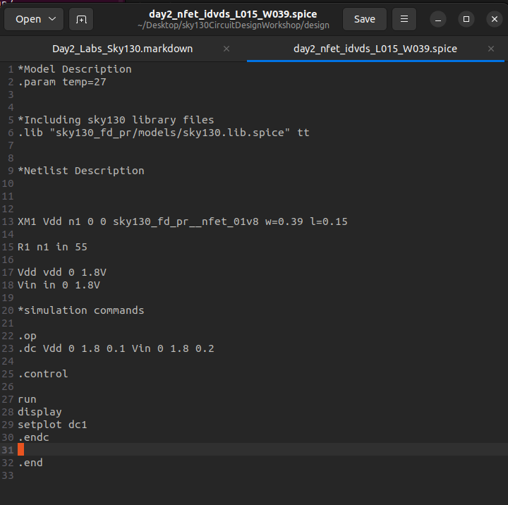
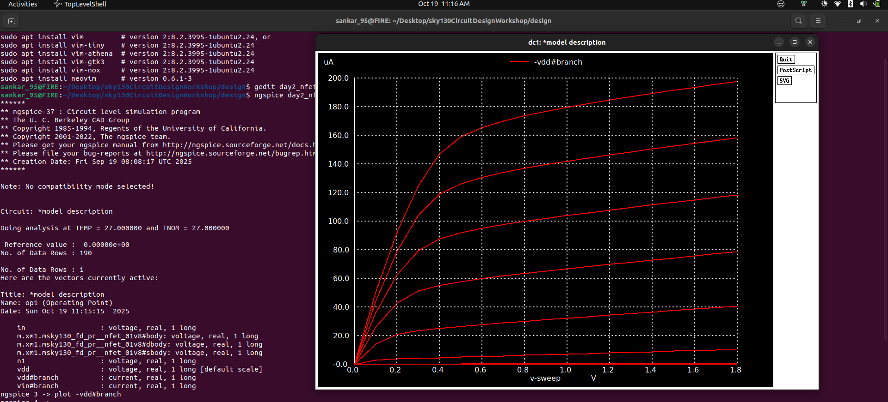
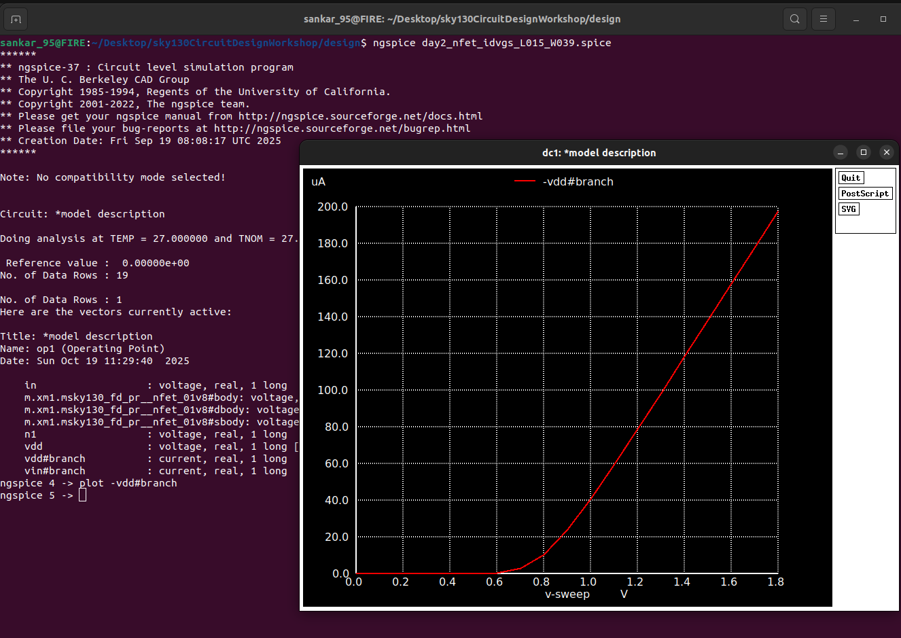

# 🎓 Labs on Day 2: Scaling Down the NMOS World – From Macro to Micro Magic!

Welcome to **Day 2** of our electrifying journey into circuit design using the Sky130 Process Design Kit (PDK)! Today, we dive deeper into NMOS transistor simulations, focusing on how *scaling*—shrinking those tiny dimensions—transforms device behavior. Think of it like upgrading from a bulky old smartphone to a sleek, modern one: smaller size, but with trade-offs in power, speed, and efficiency.

This enhanced guide includes:
- **Visual Flair**: References to graphs and images to make concepts pop! 📊
- **Tables for Clarity**: Structured comparisons and data summaries.
- **Creative Twists**: Analogies, real-world applications, and fun facts to keep things engaging.
- **Deeper Insights**: Explanations on scaling effects, backed by semiconductor physics.

**Quick Recap from Day 1**: We simulated a larger NMOS transistor (assumed L=1.5 µm, W=3.9 µm for illustration—adjust based on your setup). Now, in Day 2, we scale down to L=0.15 µm and W=0.39 µm to observe changes like reduced saturation current and altered threshold voltages. Scaling boosts chip density and speed but introduces challenges like short-channel effects (e.g., threshold voltage roll-off and increased leakage).

> **Why Scaling Matters?** 🚀  
> Moore’s Law drives us to shrink transistors for more powerful chips. But as dimensions drop below 1 µm, physics fights back: electrons misbehave in tight spaces, leading to higher electric fields, velocity saturation, and hot carrier effects. Reducing channel length (L) increases drive current but can degrade output resistance, critical for modern tech like smartphones and AI accelerators.

## 📊 Transistor Parameter Comparison: Day 1 vs Day 2

To highlight scaling’s impact, here’s a comparison table (assuming Day 1 used larger dimensions—verify with your files):

| Parameter          | Day 1 (Larger Device) | Day 2 (Scaled Device) | Scaling Effect |
|--------------------|-----------------------|-----------------------|---------------|
| **Channel Length (L)** | 1.5 µm (example)     | 0.15 µm              | Reduced L boosts speed but increases short-channel effects like Vth variation. |
| **Channel Width (W)**  | 3.9 µm (example)     | 0.39 µm              | Narrower W lowers current drive but improves density. |
| **Saturation Current (I_D,sat)** | Higher (~mA range)   | Slightly lower (~100 µA) | Due to velocity saturation in shorter channels. |
| **Threshold Voltage (V_th)** | ~0.5-0.7 V           | ~0.45 V (shifted lower) | Roll-off effect in short channels. |
| **Purpose**        | Baseline study       | Scaling analysis     | Observe trade-offs for nano-scale design. |

*Fun Fact*: Scaling has packed billions of transistors into modern chips—your phone’s processor is a testament to this magic! Below 10nm, quantum effects like tunneling crash the party.

*Image Reference*: [ID vs VDS Curve] A classic NMOS I_D vs V_DS curve showing linear and saturation regions—notice how curves flatten in saturation! (See `Screenshot_2025-10-15_21-09-50.png`)

## 🌟 Day 2 – Simulation 1: I_D vs V_DS at Constant V_GS (Output Characteristics)

Let’s kick off with the **output characteristics**—plotting Drain Current (I_D) against Drain-Source Voltage (V_DS) at fixed Gate-Source Voltage (V_GS). This reveals the transistor’s regions: **linear** (ohmic) at low V_DS, and **saturation** at high V_DS where current plateaus.

### Step 1: Navigate to the Design Directory

Fire up your terminal and hop into the workshop’s design folder—your gateway to SPICE wonders!

```bash
cd sky130CircuitDesignWorkshop/design/
```

This directory houses all `.spice` files, ready for action.

### Step 2: Dive into the Simulation File

**File**: `day2_nfet_idvds_L015_W039.spice`

#### 🔍 File Breakdown: What’s Inside?

This SPICE netlist sets up a scaled NMOS for DC analysis, sweeping V_DS from 0 to V_DD (e.g., 1.8V) at fixed V_GS steps (e.g., 0.5V, 1.0V, 1.5V).

**Transistor Parameters**:
- Channel Length (L): 0.15 µm
- Channel Width (W): 0.39 µm

**Key Equations**:
- **Linear Region**: \( I_D = \mu_n C_{ox} \frac{W}{L} [(V_{GS} - V_{th}) V_{DS} - \frac{V_{DS}^2}{2}] \)
- **Saturation Region**: \( I_D = \frac{1}{2} \mu_n C_{ox} \frac{W}{L} (V_{GS} - V_{th})^2 (1 + \lambda V_{DS}) \)

Where \(\mu_n\) is electron mobility, \(C_{ox}\) is oxide capacitance, and \(\lambda\) is channel-length modulation.

**Scaling Insight**: Shorter L increases I_D in saturation but amplifies \(\lambda\), reducing output resistance (curves slope more in saturation).

#### View the File’s Contents:

Peek inside with Vim—edit if you dare (e.g., tweak V_GS steps for more curves)!

```bash
gedit day2_nfet_idvds_L015_W039.spice
```

  <p align="center">
   
</p>


#### Run the Simulation & Plot:

Launch NGSPICE and plot the magic:

```bash
ngspice day2_nfet_idvds_L015_W039.spice
plot -vdd#branch
```

  <p align="center">
   
</p>

The result? Stunning I_D vs V_DS curves!


**Creative Analogy**: Imagine I_D as traffic on a highway (V_DS). At low traffic (low V_DS), flow is smooth (linear). Jam it up (high V_DS), and flow caps out (saturation)—scaling is like narrowing lanes for faster cars but more bottlenecks!

**Bonus Graph Interpretation Table**:

| V_GS Level | Linear Region Observation | Saturation Current (Approx.) | Key Insight |
|------------|---------------------------|------------------------------|-------------|
| 0.5V       | Gentle slope             | Low (~10 µA)                | Near threshold, weak inversion. |
| 1.0V       | Steeper rise             | Medium (~100 µA)            | Strong inversion, good for switching. |
| 1.5V       | Aggressive current       | High (~500 µA)              | Max drive, but watch power! |

*Image Reference*: [Detailed MOSFET Curves] Spot the “knee” where saturation kicks in! (Placeholder: Search “MOSFET ID vs VDS curve” for a detailed example.)

## 🚀 Day 2 – Simulation 2: I_D vs V_GS at Constant V_DS (Transfer Characteristics)

Now, shift gears to **transfer characteristics**—I_D vs V_GS at fixed V_DS (e.g., 0.1V for linear or 1.8V for saturation). This unveils the transistor’s “switching secret”: the threshold voltage (V_th) where it turns on.

**File**: `day2_nfet_idvgs_L015_W039.spice`

**Purpose Twist**: Beyond basics, this extracts transconductance (\( g_m = \frac{dI_D}{dV_{GS}} \)), key for amplifier design.

**Scaling Effect**: Shorter L lowers V_th slightly due to drain-induced barrier lowering (DIBL), making the device leakier but faster.

### Step 1: View the File’s Contents

Inspect the netlist:

```bash
gedit day2_nfet_idvgs_L015_W039.spice
```

*Image Reference*: [SPICE Netlist] Screenshot of the V_GS sweep setup. (See `Screenshot_2025-10-18_18-12-17.png`)

### Step 2: Run the Simulation:

```bash
ngspice day2_nfet_idvgs_L015_W039.spice
plot -vdd#branch
```

 <p align="center">
   
</p>

The curve rises exponentially post-V_th.


**Real-World Application**: In CPUs, low V_th from scaling enables faster switching, but higher leakage drains batteries—hence power-gating techniques!

**Extracted Metrics Table** (Typical Values):

| Metric             | Value (Approx.) | Description |
|--------------------|-----------------|-------------|
| **Threshold Voltage (V_th)** | 0.45 V         | Point where I_D rises sharply. |
| **Transconductance (g_m)**   | 100 µS/µm      | Slope in saturation—measures amplification. |
| **Subthreshold Slope**       | 80 mV/dec      | How sharply it turns off—ideal is 60 mV/dec. |

*Image Reference*: [I_D vs V_GS Curve] Exponential rise post-threshold. (Placeholder: Search “MOSFET ID vs VGS curve” for a clear example.)

## 🌌 Summary & Beyond: Unleashing Nano-Scale Potential

**Day 2 Highlights**:
- Scaled NMOS shows nuanced changes: lower currents but potential for denser circuits.
- Mastered I_D vs V_DS (output) and I_D vs V_GS (transfer) via NGSPICE.
- Learned scaling pros (speed, density) and cons (leakage, variability).

**Creative Challenge**: Imagine designing a chip for Mars rovers—how would scaling help endure radiation while saving power? Tweak L/W in SPICE and plot differences!

**Next Steps**:
- Explore PMOS simulations for complementary insights.
- Try inverter designs to see NMOS-PMOS interplay.
- Keep simulating—the circuit universe awaits! ⚡

*Image Reference*: [Combined MOSFET Curves] Holistic view of output and transfer characteristics. (Placeholder: Search “MOSFET characteristic curves” for a combined plot.)

---

**References**:
1. Moore’s Law and scaling principles: Semiconductor textbooks (e.g., Streetman & Banerjee).
2. Short-channel effects: IEEE Journals on Electron Devices.
3. SPICE simulation techniques: Sky130 PDK documentation.
