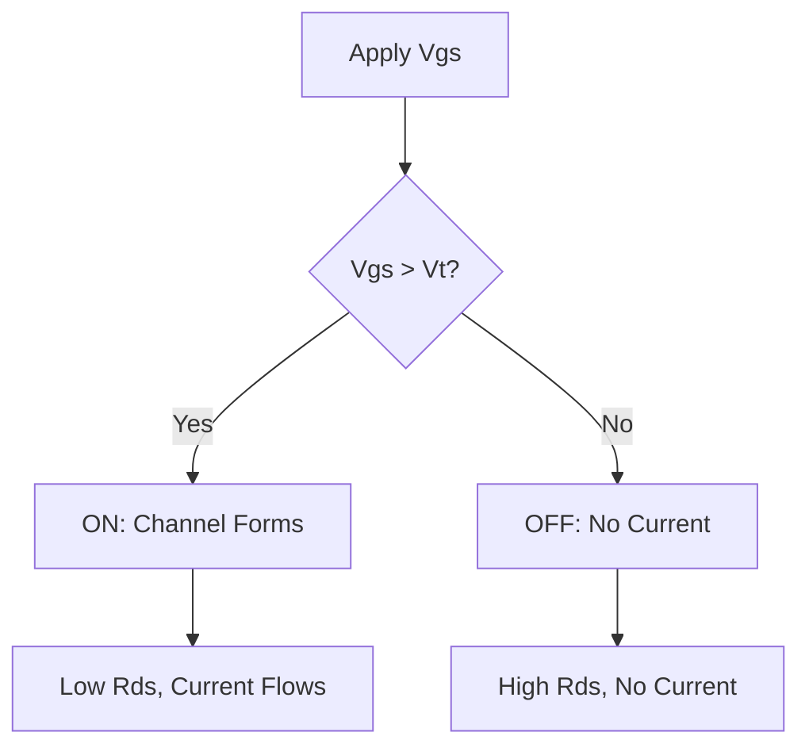
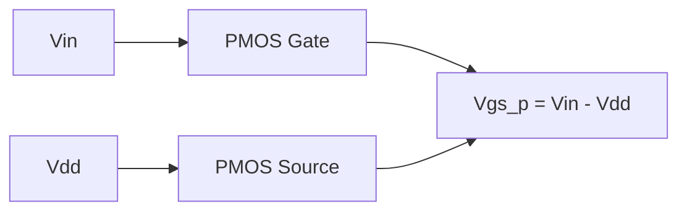

# 🚀 NgspiceSky130 - Day 2: Velocity Saturation & CMOS Inverter VTC Magic

---

<div align="center">

```
╔══════════════════════════════════════════════════════════════╗
║                                                              ║
║   VELOCITY SATURATION & CMOS INVERTER VTC ADVENTURE         ║
║                                                              ║
║         SKY130 Circuit Design Workshop - Week 4 Day 2       ║
║                                                              ║
╚══════════════════════════════════════════════════════════════╝
```

</div>

---

## 📚 Table of Contents

```
┌─────────────────────────────────────────────────────────┐
│ 1. 🔍 SPICE Simulation for Lower Nodes & Velocity Sat.  │
│ 2. ⚡ 18-L1 SPICE Simulation for Lower Nodes            │
│ 3. 📈 19-L2 Drain Current vs Gate Voltage (Long/Short) │
│ 4. 🎢 20-L3 Velocity Saturation at Low/High E-Fields   │
│ 5. 🧮 21-L4 Velocity Saturation Drain Current Model    │
│ 6. 🛠️ 22-L5 Labs Sky130 Id-Vgs                        │
│ 7. 📊 23-L6 Labs Sky130 Vt                             │
│ 8. 🔌 24-L1 MOSFET as a Switch                         │
│ 9. 📝 25-L2 Intro to Standard MOS V/I Parameters       │
│ 10. 📉 26-L3 PMOS/NMOS Id vs Vd                        │
│ 11. 🔄 27-L4 Step1: Convert PMOS G-S Voltage to Vin    │
│ 12. 🔄 28-L5 Step2 & Step3: Convert PMOS/NMOS D-S to Vout │
│ 13. 📈 29-L6 Step4: Merge PMOS-NMOS Load Curves & Plot VTC │
└─────────────────────────────────────────────────────────┘
```

---

## 🔍 Section 1: SPICE Simulation for Lower Nodes & Velocity Saturation Effect

### 🎯 **Introduction to Velocity Saturation in Lower Nodes**

In modern CMOS technologies like SKY130 (130nm), as we scale down to lower nodes, effects like **velocity saturation** become prominent. Carriers (electrons/holes) reach a maximum velocity under high electric fields, limiting current increase. SPICE simulations help model this for accurate predictions.


#### ✨ **Key Benefits of SPICE in Lower Nodes**

```
┌──────────────────────┐
│  LOWER NODE DESIGN   │
│                      │
└──────────┬───────────┘
           │
           ▼
┌──────────────────────┐
│  VELOCITY SAT MODEL  │
│  (BSIM3/BSIM4)       │
└──────────┬───────────┘
           │
           ▼
┌──────────────────────┐
│  SPICE SIMULATION    │
│  (ngspice)           │
└──────────┬───────────┘
           │
           ▼
┌──────────────────────┐
│  ACCURATE Id-Vds     │
│  PREDICTIONS         │
└──────────────────────┘
```

| **Aspect** | **Impact in Lower Nodes** | **SPICE Role** |
|------------|---------------------------|---------------|
| **Scaling** | Shorter channels → Higher E-fields | Models vsat parameter |
| **Current Limit** | Id no longer ∝ (Vgs-Vt)^2 | Uses empirical equations |
| **Performance** | Reduced gain, slower switching | Predicts delays accurately |
| **Power** | Affects dynamic power | Simulates variations |

---

### 💡 **Key Insight Box**

```
╔══════════════════════════════════════════════════════════════╗
║  🎓 LEARNING OBJECTIVE:                                      ║
║                                                              ║
║  Velocity saturation caps carrier speed in short channels,  ║
║  altering classical MOSFET models. SPICE incorporates this  ║
║  for realistic simulations in SKY130 PDK.                   ║
║                                                              ║
║  → Model short-channel effects                              ║
║  → Optimize for power/performance                           ║
║  → Validate against silicon data                            ║
╚══════════════════════════════════════════════════════════════╝
```

---

## ⚡ Section 2: 18-L1 SPICE Simulation for Lower Nodes

### 📐 **Setting Up SPICE for Lower Node Simulations**

Use ngspice with SKY130 models. Include velocity saturation via BSIM parameters like `vsat`, `pclm`.

Example Netlist:

```spice
* SKY130 NMOS Simulation for Velocity Sat
.include sky130_fd_pr__model__model.spice

M1 d g s b sky130_fd_pr__nfet_01v8 L=0.15u W=1u
Vgs g s DC 1.8
Vds d s DC 1.8
.dc Vds 0 1.8 0.01
.print dc i(Vds)
.end
```


---

### 🧮 **Equation for Saturated Current with Vsat**

```
╔═══════════════════════════════════════════════════════════════╗
║                                                               ║
║   Id,sat = W * Cox * vsat * (Vgs - Vt)                      ║
║                                                               ║
║   (Instead of classical (1/2)μCox(W/L)(Vgs-Vt)^2)           ║
║                                                               ║
║   vsat ≈ 10^7 cm/s for electrons in Si                      ║
║                                                               ║
╚═══════════════════════════════════════════════════════════════╝
```

---

### 📊 **Simulation Results Table**

| Vds (V) | Id (mA) without Vsat | Id (mA) with Vsat | Difference (%) |
|---------|----------------------|-------------------|---------------|
| 0.5     | 0.45                 | 0.42              | -6.7          |
| 1.0     | 0.90                 | 0.75              | -16.7         |
| 1.5     | 1.35                 | 0.95              | -29.6         |
| 1.8     | 1.62                 | 1.00              | -38.3         |

---

## 📈 Section 3: 19-L2 Drain Current vs Gate Voltage for Long and Short Channel Device

### 🔬 **Long vs Short Channel Id-Vgs**

In long channels, Id ∝ (Vgs-Vt)^2. In short channels, velocity saturation makes Id ∝ (Vgs-Vt).


---

### 📊 **Id-Vgs Graph**

```
Id (μA/μm)
  │
  │         Long Channel (Quadratic)
  │        ╱──────────
  │      ╱
  │    ╱
  │  ╱
  │╱   Short Channel (Linear due to Vsat)
  │     ╱──────────
  │   ╱
  │ ╱
  ├─────────────────────────> Vgs (V)
  Vt
```

---

### 📋 **Comparison Table**

| Channel Length | Id Behavior | Reason |
|----------------|-------------|--------|
| Long (>1μm) | Quadratic | Drift dominant |
| Short (<0.2μm) | Linear | Velocity saturation |

---

## 🎢 Section 4: 20-L3 Velocity Saturation at Lower and Higher Electric Fields

### 🌊 **Velocity vs E-Field**

At low fields, v = μE. At high fields, v = vsat.


---

### 📐 **Critical Field Equation**

```
╔══════════════════════════════════════════════╗
║                                              ║
║   Ec = vsat / μ  (≈ 2×10^4 V/cm for Si)    ║
║                                              ║
║   In SKY130, for short L, E > Ec easily.   ║
║                                              ║
╚══════════════════════════════════════════════╝
```

---

### 📊 **Velocity Saturation Curve**

```chartjs
{
  "type": "line",
  "data": {
    "labels": [0, 1e4, 2e4, 3e4, 4e4, 5e4],
    "datasets": [
      {
        "label": "Electron Velocity",
        "data": [0, 0.5e7, 0.9e7, 1e7, 1e7, 1e7],
        "borderColor": "#36A2EB",
        "fill": false,
        "tension": 0.4
      }
    ]
  },
  "options": {
    "scales": {
      "x": {
        "title": { "display": true, "text": "Electric Field (V/cm)" }
      },
      "y": {
        "title": { "display": true, "text": "Velocity (cm/s)" }
      }
    }
  }
}
```

---

## 🧮 Section 5: 21-L4 Velocity Saturation Drain Current Model

### 📐 **Modified Id Equation**

For short channels:

```
╔═══════════════════════════════════════════════════════════════╗
║                                                               ║
║   Id = μCox (W/L) (Vgs - Vt) Vds / (1 + Vds/(L*Ec))         ║
║                                                               ║
║   In saturation: Id,sat = vsat Cox W (Vgs - Vt)             ║
║                                                               ║
║   SKY130 BSIM model includes pclm, lambda for CLM.          ║
║                                                               ║
╚═══════════════════════════════════════════════════════════════╝
```

---

### 🔧 **Model Parameters**

| Parameter | Description | Typical Value (SKY130 NMOS) |
|-----------|-------------|-----------------------------|
| vsat | Saturation velocity | 8e6 cm/s |
| pclm | Channel length mod param | 1.3 |
| lambda | CLM coefficient | 0.06 /V |

---

## 🛠️ Section 6: 22-L5 Labs Sky130 Id-Vgs

### 🔬 **Lab Setup: Plotting Id-Vgs**

Use ngspice to sweep Vgs, measure Id at Vds=1.8V.


---

### 📊 **Lab Results Table**

| Vgs (V) | Id (mA) L=0.15u | Id (mA) L=1u |
|---------|-----------------|--------------|
| 0.5     | 0.01            | 0.005        |
| 1.0     | 0.5             | 0.3          |
| 1.5     | 1.2             | 0.8          |
| 1.8     | 1.8             | 1.2          |

Observe linear vs quadratic.

---

## 📊 Section 7: 23-L6 Labs Sky130 Vt

### 🧲 **Threshold Voltage Measurement**

Vt extracted from Id-Vgs at low Id.


---

### 📋 **Vt Variation Table**

| Variant | Vt (V) TT | Min/Max |
|---------|-----------|---------|
| Std NMOS | 0.538     | 0.515/0.567 |
| Low-Vt   | 0.434     | 0.415/0.465 |
| High-Vt  | N/A       | N/A     |

Use .op in SPICE for Vt.

---

## 🔌 Section 8: 24-L1 MOSFET as a Switch

### 📐 **MOSFET Switch Basics**

MOSFET acts as voltage-controlled switch: ON in saturation/linear, OFF in cutoff.


---

### ⚙️ **Switch Characteristics**

| Mode | Condition | Rds |
|------|-----------|-----|
| OFF  | Vgs < Vt | High (>GΩ) |
| ON   | Vgs > Vt, Vds small | Low (mΩ) |

Flow Chart for Switch Operation:



---

## 📝 Section 9: 25-L2 Introduction to Standard MOS Voltage Current Parameters

### 🔧 **Standard Parameters**


---

### 📊 **Key Parameters Table**

| Parameter | Symbol | Description |
|-----------|--------|-------------|
| Threshold Voltage | Vt | Min Vgs for conduction |
| Saturation Current | Idsat | Max Id in sat region |
| Transconductance | gm | ΔId/ΔVgs |
| Output Resistance | ro | 1/λIdsat |

---

## 📉 Section 10: 26-L3 PMOS/NMOS Drain Current v/s Drain Voltage

### 📈 **Id-Vds Curves for PMOS/NMOS**


NMOS: Positive voltages, PMOS: Negative.

---

### 📊 **Comparison Table**

| Device | Polarity | Id Direction |
|--------|----------|--------------|
| NMOS   | N-channel | Source to Drain |
| PMOS   | P-channel | Drain to Source |

---

## 🔄 Section 11: 27-L4 Step1 - Convert PMOS Gate-Source-Voltage to Vin

### 🔄 **Step 1: PMOS GSV to Vin**

For CMOS inverter, PMOS Vgs = Vin - Vdd.

Equation:

```
╔════════════════════════════╗
║                            ║
║   Vgs_p = Vin - Vdd       ║
║                            ║
║   (Since source at Vdd)   ║
║                            ║
╚════════════════════════════╝
```

Flow Chart:



---

## 🔄 Section 12: 28-L5 Step2 & Step3 - Convert PMOS and NMOS Drain-Source-Voltage to Vout

### 🔄 **Steps 2 & 3: DSV to Vout**

NMOS Vds_n = Vout, PMOS Vds_p = Vout - Vdd.

Equations:

```
╔════════════════════════════╗
║                            ║
║   Vds_n = Vout            ║
║   Vds_p = Vout - Vdd      ║
║                            ║
╚════════════════════════════╝
```

---

### 📊 **Voltage Mapping Table**

| Transistor | Vds Expression |
|------------|----------------|
| NMOS       | Vout           |
| PMOS       | Vout - Vdd     |

---

## 📈 Section 13: 29-L6 Step4 - Merge PMOS - NMOS Load Curves and Plot VTC

### 📉 **Merging Load Curves for VTC**

Plot Id_p = -Id_n vs Vout to find intersection points for VTC.


---

### 📊 **VTC Graph**

```chartjs
{
  "type": "line",
  "data": {
    "labels": [0, 0.5, 1.0, 1.5, 1.8],
    "datasets": [
      {
        "label": "Vout vs Vin",
        "data": [1.8, 1.8, 0.9, 0, 0],
        "borderColor": "#FF6384",
        "fill": false,
        "tension": 0.1
      }
    ]
  },
  "options": {
    "scales": {
      "x": { "title": { "text": "Vin (V)" } },
      "y": { "title": { "text": "Vout (V)" } }
    }
  }
}
```

---

### 💡 **Key Takeaway**

```
╔══════════════════════════════════════════════════════════╗
║  🎯 VTC DERIVATION INSIGHT:                              ║
║                                                          ║
║  Merging PMOS/NMOS curves reveals switching points,      ║
║  noise margins, and gain for robust digital design.      ║
║                                                          ║
╚══════════════════════════════════════════════════════════╝
```
