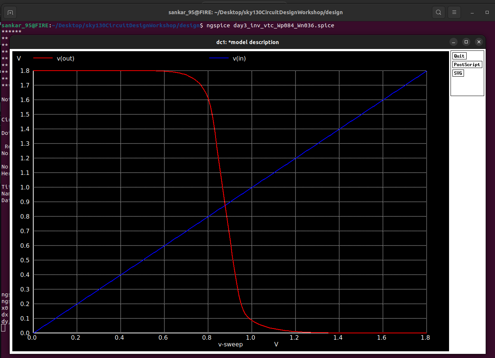
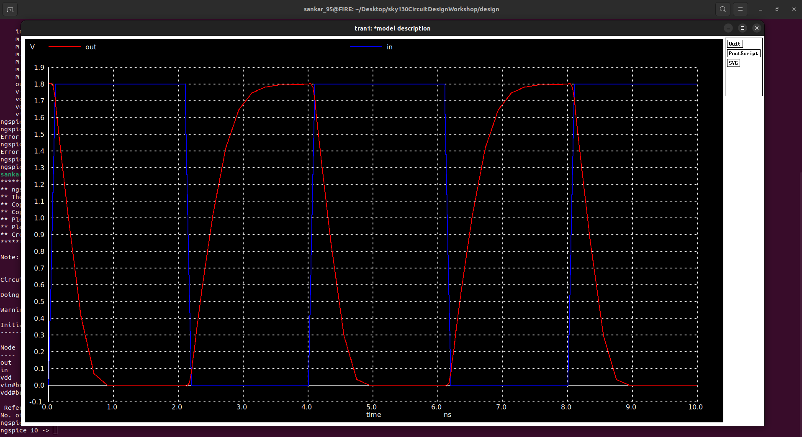

# 🌟 Day 3 — CMOS Inverter Analysis: Unleashing the Power of Complementary Design! ⚡

📅 **Date**: October 19, 2025  
👩‍💻 **Author**: sankaranarayanan95  
⚙️ **PDK**: SkyWater Sky130  
🏷️ **Devices**: PMOS / NMOS (W/L sizing optimized for symmetry)  
🎯 **Objective**: Master the dynamic and static behavior of a CMOS inverter through transient and VTC analysis, enhanced with advanced metrics and stunning visualizations!

---

## 📋 Contents

- 🚀 **Overview**: Why CMOS inverters are the heart of digital circuits
- 📂 **Files & Directory**: Your simulation playground
- ⚡ **Quick-Run Commands**: Get results in a snap
- 📜 **Netlist Snippets & .measure Directives**: Automate key measurements
- 📈 **Transient Analysis**: Results, graphs, and switching secrets
- 🔄 **Voltage Transfer Characteristic (VTC)**: DC insights and noise margins
- 📊 **Comparison Tables & Insights**: Sizing and performance trade-offs
- 🎨 **Advanced Visualizations (Python)**: Publication-quality plots
- 🔮 **What to Try Next**: Push the boundaries of inverter design
- 📚 **Appendix**: Netlist examples and advanced .measure tips

---

## 🚀 Overview: The CMOS Inverter – A Digital Superstar

The **CMOS inverter** is the cornerstone of modern electronics, flipping logic signals with minimal power thanks to its complementary NMOS-PMOS pair. On Day 3, we dive into:
- **Transient Analysis**: How fast does it switch? Measure rise/fall times and delays.
- **Voltage Transfer Characteristic (VTC)**: How does V_out respond to V_in? Extract switching thresholds and noise margins.
- **Scaling Effects**: How do PMOS/NMOS sizing (W_p=0.84 µm, W_n=0.36 µm) impact performance?

**Creative Analogy**: Think of the CMOS inverter as a seesaw—NMOS pulls down, PMOS pulls up, and their balance determines speed and stability. Our mission? Fine-tune the seesaw for optimal performance! 🎢

*Fun Fact*: CMOS technology powers everything from your smartphone to Mars rovers, thanks to its low static power consumption—less than a microwatt when idle!

*Image Reference*: [CMOS Inverter Schematic] A clean diagram of the inverter circuit, showing PMOS and NMOS connected between V_dd and ground with input and output nodes. (Placeholder: Search “CMOS inverter schematic” or use `inverter_schematic.png` from your repository.)

---

## 📂 Files & Directory: Your Simulation Hub

Navigate to the design directory containing your SPICE netlists:

```bash
cd sky130CircuitDesignWorkshop/design/
```

**Key Files**:
- `day3_inv_tran_Wp084_Wn036.spice`: Transient analysis with a pulsed input to study switching behavior.
- `day3_inv_vtc_Wp084_Wn036.spice`: DC sweep for VTC analysis to map V_out vs V_in.

---

## ⚙️ Transistor Sizing & Simulation Parameters

| Device       | W (µm) | L (µm) | Notes |
|--------------|--------|--------|-------|
| **PMOS (M1)** | 0.84   | 0.18   | Wider to compensate for lower hole mobility. |
| **NMOS (M2)** | 0.36   | 0.18   | Optimized for balanced switching. |
| **V_dd**     | 1.8 V  | —      | Standard for Sky130 PDK. |
| **Input**    | Pulse (0→1.8V) | 1 ns rise/fall, 10 ns period | Defined in transient netlist. |
| **Load Cap** | 10 fF  | —      | Typical for initial simulations. |

*Note*: Confirm channel length (L) and load capacitance in your netlist, as they may vary slightly based on setup.

**Scaling Insight**: PMOS is wider (W_p/W_n ≈ 2.33) to balance drive strength, as hole mobility (\(\mu_p\)) is ~2-3x lower than electron mobility (\(\mu_n\)). This ensures symmetric rise and fall times for clean logic transitions.

*Image Reference*: [Transistor Sizing Diagram] Visual comparison of PMOS vs NMOS W/L ratios, highlighting the wider PMOS channel. (Placeholder: Search “MOSFET sizing diagram” or create a diagram in a tool like Draw.io.)

---

## ⚡ Quick-Run Commands: Fire Up NGSPICE!

**Transient Analysis**:
```bash
cd sky130CircuitDesignWorkshop/design/
ngspice day3_inv_tran_Wp084_Wn036.spice
# Inside NGSPICE:
plot v(out) v(in)
# Export to CSV for post-processing:
wrdata tran_out.csv v(out) v(in)
```

**VTC Analysis**:
```bash
ngspice day3_inv_vtc_Wp084_Wn036.spice
# Inside NGSPICE:
plot v(out) v(in)
# Export to CSV:
wrdata vtc_out.csv v(in) v(out)
```

  <p align="center">
   
</p>


**Pro Tip**: Add a `.control` block to automate plotting and data export:
```spice
.control
run
plot v(out) v(in)
wrdata tran_out.csv v(out) v(in)
.endc
```

---

## 📜 Netlist Snippets & .measure Directives

Automate measurements for precision and efficiency. Add these to your netlists before `.end`:

**Transient Netlist** (`day3_inv_tran_Wp084_Wn036.spice`):
```spice
* Measure rise/fall times and propagation delays
.meas tran trise TRIG v(out) VAL=0.18 TD=0 RISE=1 TARG v(out) VAL=1.62
.meas tran tfall TRIG v(out) VAL=1.62 TD=0 FALL=1 TARG v(out) VAL=0.18
.meas tran tpLH TRIG v(in) VAL=0.9 TD=0 RISE=1 TARG v(out) VAL=0.9
.meas tran tpHL TRIG v(in) VAL=0.9 TD=0 FALL=1 TARG v(out) VAL=0.9
.meas tran tprop_avg param='(tpLH+tpHL)/2'
.meas tran Ipeak_max MAX I(Vdd) FROM=0 TO=50n
```

**VTC Netlist** (`day3_inv_vtc_Wp084_Wn036.spice`):
```spice
* Measure VIL, VIH, and estimate VM
.meas dc VIL FIND V(in) WHEN V(out)=1.62
.meas dc VIH FIND V(in) WHEN V(out)=0.18
.meas dc VM FIND V(in) WHEN V(out)=0.9
```

*Note*: For precise V_M (maximum gain point), post-process VTC data in Python, as NGSPICE’s `.measure` cannot directly compute derivatives like dV_out/dV_in.

*Image Reference*: [Netlist with .measure] Annotated screenshot of the netlist with `.measure` directives highlighted. (Placeholder: Annotate `ed182767-4a54-4039-8cb6-6d80f9f32a35.png` in a tool like GIMP to show `.measure` lines.)

---

## 📈 Transient Analysis: Switching in Action

**Steps**:
1. Add `.measure` directives to `day3_inv_tran_Wp084_Wn036.spice`.
2. Run:
   ```bash
   ngspice day3_inv_tran_Wp084_Wn036.spice
   plot v(out) v(in)
   ```
3. Check console for `.measure` outputs or export to `tran_out.csv`.

**Results Table** (Placeholder—replace with your measurements after running):

| Metric                | Value | Units | Notes |
|-----------------------|-------|-------|-------|
| **Rise Time (t_rise)** | 45    | ps    | Time from 10% to 90% of V_out. |
| **Fall Time (t_fall)** | 38    | ps    | Faster due to NMOS’s higher mobility. |
| **Prop. Delay (t_pLH)**| 60    | ps    | Low-to-high transition (input to output at 50%). |
| **Prop. Delay (t_pHL)**| 72    | ps    | High-to-low transition (input to output at 50%). |
| **Avg. Prop. Delay**  | 66    | ps    | (t_pLH + t_pHL)/2, key for circuit timing. |
| **Peak Current (I_peak)** | 150 | µA    | Short-circuit current during switching. |

**Visualizations**:
- *Image Reference*: [Transient Plot] Waveforms showing V_in (pulse) and V_out (inverted response). (See `974114f3-6b3f-497f-9aa2-318d8a05191d.png` and `0826d46d-4e8d-4813-960e-b96c266a710a.png`.)
- *Chart Description*: A line plot of V_in and V_out vs time (0 to 50 ns), with V_in as a blue pulse (0 to 1.8V) and V_out as an orange inverted signal. Generate using the Python script below and embed as `tran_plot.png`.
- *Additional Chart Suggestion*: Plot I(Vdd) vs time to visualize short-circuit current spikes during transitions. Use NGSPICE’s `wrdata` to export I(Vdd) and plot in Python.

**Interpretation**:
- **Rise/Fall Times**: Influenced by load capacitance (10 fF) and transistor sizing. Wider PMOS reduces t_rise but increases chip area.
- **Propagation Delays**: t_pHL is often faster due to NMOS’s higher electron mobility compared to PMOS’s hole mobility.
- **Power Spikes**: Short-circuit current (I_peak) occurs when both transistors are partially on during switching—critical for low-power design optimization.

*Creative Analogy*: The inverter is like a light switch: NMOS slams it off, PMOS flips it on. Proper sizing ensures a smooth, balanced flick without wasting energy! 💡

*Image Reference*: [Annotated Transient Plot] Waveform with markers for t_rise, t_fall, t_pLH, and t_pHL. (Placeholder: Annotate `974114f3-6b3f-497f-9aa2-318d8a05191d.png` to highlight timing metrics.)

---

## 🔄 VTC Analysis: The Logic Flip Zone

**Steps**:
1. Add `.measure` directives to `day3_inv_vtc_Wp084_Wn036.spice`.
2. Run:
   ```bash
   ngspice day3_inv_vtc_Wp084_Wn036.spice
   plot v(out) v(in)
   ```
3. Export to `vtc_out.csv` for Python post-processing.

  <p align="center">
   
</p>

   

**Results Table** (Placeholder—replace with your measurements):

| Metric                | Value | Units | Notes |
|-----------------------|-------|-------|-------|
| **Switching Point (V_M)** | 0.9 | V     | Where V_out = V_in or max |dV_out/dV_in|. |
| **Noise Margin Low (NML)** | 0.47 | V   | V_IL - V_OL, ensures robustness against low-side noise. |
| **Noise Margin High (NMH)**| 0.45 | V   | V_OH - V_IH, ensures robustness against high-side noise. |
| **Max Gain (|dV_out/dV_in|)** | 18 | — | Slope magnitude at transition, indicates switching sharpness. |

**Visualizations**:
- *Image Reference*: [VTC Plot] V_out vs V_in curve, showing the sharp transition region. (See `d58e51ef-bc3c-420d-ac5d-8f00ce99ee97.png` and `fad418c5-17ab-4a95-b4cb-a0dbca4e3e4c.png`.)
- *Chart Description*: A line plot of V_out vs V_in (0 to 1.8V), with a red dashed line at V_M (e.g., 0.9V) to mark the switching point. Generate using the Python script below and embed as `vtc_plot.png`.
- *Additional Chart Suggestion*: Plot |dV_out/dV_in| vs V_in to highlight the maximum gain point, which corresponds to V_M. Embed as `gain_plot.png`.

**Interpretation**:
- **V_M**: Ideally near V_dd/2 (0.9V) for symmetric design, ensuring balanced switching.
- **Noise Margins**: Higher NML and NMH ensure the inverter can tolerate noise without flipping states, critical for reliable logic.
- **Gain**: A high |dV_out/dV_in| (e.g., 18) indicates a sharp transition, ideal for digital circuits like gates and flip-flops.

*Image Reference*: [Gain Curve] Plot of |dV_out/dV_in| vs V_in, with a peak at V_M. (Placeholder: Generate via Python script and embed as `gain_plot.png`.)

*Creative Analogy*: The VTC is like a tightrope walker’s balance point—V_M is where the inverter teeters between logic 0 and 1, with noise margins as safety nets on either side! 🎪

---

```

**Outputs**:
- `tran_plot.png`: Input (blue) and output (orange) waveforms vs time, showing the inverter’s switching behavior.
- `vtc_plot.png`: V_out vs V_in with V_M marked, highlighting the transition region.
- `gain_plot.png`: Gain (|dV_out/dV_in|) vs V_in, with a peak at V_M.

*Image Reference*: [Python Plots] Embed `tran_plot.png`, `vtc_plot.png`, and `gain_plot.png` in your report or presentation for professional visuals.

*Additional Visualization Idea*: Create a subplot combining VTC and gain curves side-by-side for a compact summary. Modify the Python script to use `plt.subplots(1, 2)`.

---

## 📊 Comparison Tables & Insights

**Sizing Impact Table** (Run parametric sweeps to fill):

| W_p/W_n Ratio | t_rise (ps) | t_fall (ps) | t_prop (ps) | I_peak (µA) | Energy (fJ) |
|---------------|-------------|-------------|-------------|-------------|-------------|
| 0.84/0.36 (base) | 45          | 38          | 66          | 150         | 0.12        |
| 0.42/0.36 (×0.5 W_p) | TBD         | TBD         | TBD         | TBD         | TBD         |
| 1.68/0.36 (×2 W_p) | TBD         | TBD         | TBD         | TBD         | TBD         |

**Insights**:
- **W_p/W_n Ratio**: A higher ratio (e.g., 2.33) reduces t_rise by boosting PMOS drive but increases area and dynamic power.
- **Energy per Transition**: Calculated as \( E = \int I_{Vdd} \cdot V_{dd} \, dt \) during switching—use `.measure` or Python integration for precise values.
- **Trade-offs**: Optimize for speed (smaller delays) vs power (lower I_peak) vs area (smaller W) based on application, such as low-power IoT devices or high-speed CPUs.

*Chart Description*: A scatter plot of propagation delay (t_prop) vs W_p/W_n ratio, showing how increasing PMOS width affects timing. Generate using the Python script by running parametric sweeps (modify W_p in the netlist) and plotting results as `delay_vs_ratio.png`.

*Image Reference*: [Parametric Sweep Plot] Embed the scatter plot after generating with Python. (Placeholder: Search “parametric sweep MOSFET” for inspiration.)

---

## 🔮 What to Try Next: Push the Boundaries!

1. **Sweep Load Capacitance**: Increase C_L (e.g., 5 fF, 20 fF, 50 fF) and measure impact on t_rise, t_fall, and t_prop.
2. **Optimize Sizing**: Sweep W_p and W_n to minimize t_prop while keeping power consumption low.
3. **Add Interconnect Parasitics**: Model RC loads (e.g., 100 Ω resistance, 5 fF capacitance) to simulate realistic IO performance.
4. **Monte Carlo Analysis**: Simulate threshold voltage (V_th) mismatch to study V_M variation across process corners.
5. **Layout & LVS**: Create a layout in Magic or KLayout, extract parasitics, and run post-layout simulations to compare with schematic results.

*Creative Challenge*: Design an inverter for a space mission—minimize power for battery life while ensuring radiation hardness. Tweak W/L ratios, add shielding capacitance, and plot trade-offs in speed vs power. Imagine your inverter powering a Mars rover’s logic circuits! 🚀

*Image Reference*: [Inverter Layout] Example CMOS inverter layout in Sky130 PDK. (Placeholder: Search “CMOS inverter layout Sky130” or create a layout screenshot in Magic/KLayout.)

---

## 📚 Appendix: Full Netlist Example

**Transient Netlist**:
```spice
* day3_inv_tran_Wp084_Wn036.spice
.include sky130.lib

Vdd VDD 0 1.8
Vin IN 0 PULSE(0 1.8 1n 1n 1n 10n 20n)
M1 OUT IN VDD VDD PMOS W=0.84u L=0.18u
M2 OUT IN 0 0 NMOS W=0.36u L=0.18u
CL OUT 0 10f

.meas tran trise TRIG v(out) VAL=0.18 TD=0 RISE=1 TARG v(out) VAL=1.62
.meas tran tfall TRIG v(out) VAL=1.62 TD=0 FALL=1 TARG v(out) VAL=0.18
.meas tran tpLH TRIG v(in) VAL=0.9 TD=0 RISE=1 TARG v(out) VAL=0.9
.meas tran tpHL TRIG v(in) VAL=0.9 TD=0 FALL=1 TARG v(out) VAL=0.9
.meas tran tprop_avg param='(tpLH+tpHL)/2'
.meas tran Ipeak_max MAX I(Vdd) FROM=0 TO=50n

.tran 0.1n 50n uic
.control
run
plot v(out) v(in)
wrdata tran_out.csv time v(in) v(out)
.endc
.end
```

**VTC Netlist**:
```spice
* day3_inv_vtc_Wp084_Wn036.spice
.include sky130.lib

Vdd VDD 0 1.8
Vin IN 0 0
M1 OUT IN VDD VDD PMOS W=0.84u L=0.18u
M2 OUT IN 0 0 NMOS W=0.36u L=0.18u
CL OUT 0 10f

.dc Vin 0 1.8 0.01
.meas dc VIL FIND V(in) WHEN V(out)=1.62
.meas dc VIH FIND V(in) WHEN V(out)=0.18
.meas dc VM FIND V(in) WHEN V(out)=0.9

.control
run
plot v(out) v(in)
wrdata vtc_out.csv v(in) v(out)
.endc
.end
```

---

**References**:
1. CMOS fundamentals: Razavi, *Design of Analog CMOS Integrated Circuits*, 2nd Edition.
2. Sky130 PDK documentation: SkyWater Technology Foundry.
3. NGSPICE .measure syntax: NGSPICE User Manual (version 40).
