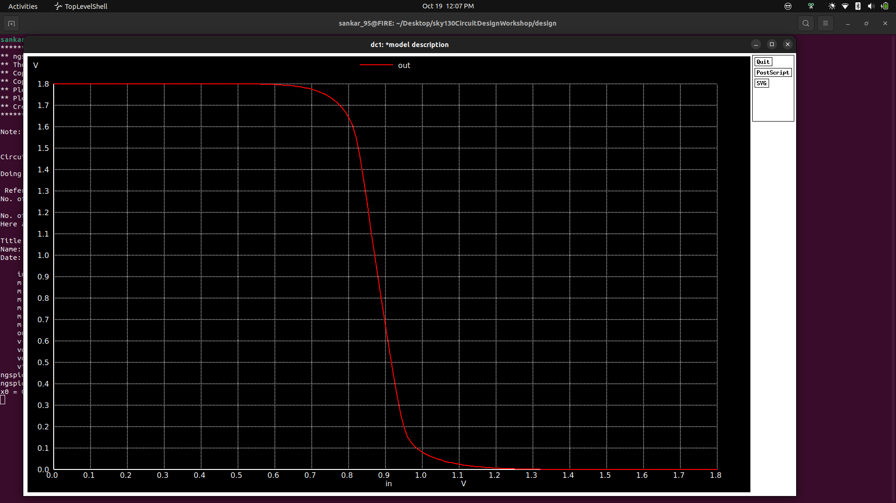

# 🌟 Day 4 — CMOS Inverter Noise Margin Analysis: Building Robust Digital Circuits! ⚡

📅 **Date**: October 19, 2025  
👩‍💻 **Author**: sankaranarayanan95  
⚙️ **PDK**: SkyWater Sky130  
🏷️ **Devices**: PMOS / NMOS (Optimized for Noise Immunity)  
🎯 **Objective**: Quantify the noise margins of a CMOS inverter to ensure robust logic operation, enhanced with stunning visualizations and deep insights!

---

## 📋 Contents

- 🚀 **Overview**: Why noise margins are the shield of digital circuits
- 📂 **Files & Directory**: Your simulation launchpad
- ⚡ **Quick-Run Commands**: Instant results with NGSPICE
- 📜 **Netlist Snippets & .measure Directives**: Automate noise margin extraction
- 📈 **VTC Analysis**: Results, graphs, and noise margin magic
- 📊 **Comparison Tables & Insights**: Sizing and noise immunity trade-offs
- 🎨 **Advanced Visualizations (Python)**: Publication-quality plots
- 🔮 **What to Try Next**: Explore advanced inverter designs
- 📚 **Appendix**: Netlist examples and advanced .measure tips

---

## 🚀 Overview: Noise Margins – The Shield of Digital Circuits

The **CMOS inverter** is the backbone of digital logic, flipping signals with precision. On Day 4, we focus on its **noise margins**—the buffer zones that protect logic levels from noise-induced errors. By analyzing the Voltage Transfer Characteristic (VTC), we measure:
- **V_OH** (Logic High Output): Maximum output voltage.
- **V_OL** (Logic Low Output): Minimum output voltage.
- **V_IH** and **V_IL**: Input thresholds for high and low logic.
- **NMH** and **NML**: Noise margins for high and low states.

**Creative Analogy**: Think of noise margins as the guardrails on a digital highway. Without them, noisy signals (like potholes) could derail your logic from 1 to 0 or vice versa. Our mission? Build guardrails wide enough for reliable operation! 🛣️

*Fun Fact*: Noise margins are why your smartphone keeps working in noisy environments like crowded cities or near Wi-Fi routers. A robust CMOS inverter shrugs off interference like a superhero! 🦸

*Image Reference*: [CMOS Inverter VTC] A classic VTC curve showing V_OH, V_OL, V_IH, V_IL, and noise margins. (Placeholder: Search “CMOS inverter VTC noise margin” or use `inverter_vtc_diagram.png`.)

---

## 📂 Files & Directory: Your Simulation Launchpad

Navigate to the design directory containing your SPICE netlist:

```bash
cd sky130CircuitDesignWorkshop/design/
```

**Key File**:
- `day4_inv_noisemargin_wp1_wn036.spice`: DC sweep to generate the VTC and calculate noise margins.

*Image Reference*: [Netlist in Vim] Screenshot of the netlist open in Vim, showing transistor sizing and DC sweep setup. (See `069e6be9-ee9d-46dd-b191-0d02385e813b.png`.)

---

## ⚙️ Transistor Sizing & Simulation Parameters

| Device       | W (µm) | L (µm) | Notes |
|--------------|--------|--------|-------|
| **PMOS (M1)** | 1.0    | 0.18   | Wider for balanced switching and noise immunity. |
| **NMOS (M2)** | 0.36   | 0.18   | Optimized for symmetry with PMOS. |
| **V_dd**     | 1.8 V  | —      | Standard for Sky130 PDK. |
| **Input**    | DC Sweep (0→1.8V) | Step size: 0.01V | Defined in netlist for VTC. |
| **Load Cap** | 10 fF  | —      | Typical for inverter simulations. |

*Note*: Confirm channel length (L) and load capacitance in your netlist, as they may vary slightly.

**Sizing Insight**: The PMOS width (W_p = 1 µm) is ~2.78x the NMOS width (W_n = 0.36 µm) to balance drive strength, compensating for lower hole mobility (\(\mu_p\)) compared to electron mobility (\(\mu_n\)). This ensures a symmetric VTC and robust noise margins.

*Image Reference*: [Transistor Sizing Diagram] Visual of PMOS vs NMOS channel widths, highlighting the W_p/W_n ratio. (Placeholder: Search “CMOS inverter sizing diagram” or create in Draw.io.)

---

## ⚡ Quick-Run Commands: Fire Up NGSPICE!

**VTC Analysis**:
```bash
cd sky130CircuitDesignWorkshop/design/
ngspice day4_inv_noisemargin_wp1_wn036.spice
# Inside NGSPICE:
plot out vs in
# Export to CSV for post-processing:
wrdata vtc_out.csv in out
```

**Pro Tip**: Add a `.control` block to automate plotting and data export:
```spice
.control
run
plot out vs in
wrdata vtc_out.csv in out
.endc
```
  <p align="center">
   
</p>


---

## 📜 Netlist Snippets & .measure Directives

Automate noise margin calculations with these `.measure` directives, added before `.end` in `day4_inv_noisemargin_wp1_wn036.spice`:

```spice
* Measure VOH, VOL, VIL, VIH, and noise margins
.meas dc VOH FIND V(out) WHEN V(in)=0
.meas dc VOL FIND V(out) WHEN V(in)=1.8
.meas dc VIL FIND V(in) WHEN V(out)=1.62
.meas dc VIH FIND V(in) WHEN V(out)=0.18
.meas dc VM FIND V(in) WHEN V(out)=0.9
.meas dc NMH param='VOH-VIH'
.meas dc NML param='VIL-VOL'
```

*Note*: V_M (switching point) is approximated where V_out = V_dd/2 (0.9V). For precise V_M (maximum gain point), compute dV_out/dV_in in Python, as NGSPICE cannot directly differentiate in `.measure`.

*Image Reference*: [Netlist with .measure] Annotated screenshot of the netlist with `.measure` directives highlighted. (Placeholder: Annotate `069e6be9-ee9d-46dd-b191-0d02385e813b.png` to show `.measure` lines.)

---

## 📈 VTC Analysis: Decoding Noise Margin Magic

**Steps**:
1. Add `.measure` directives to `day4_inv_noisemargin_wp1_wn036.spice`.
2. Run:
   ```bash
   ngspice day4_inv_noisemargin_wp1_wn036.spice
   plot out vs in
   ```
3. Check console for `.measure` outputs or export to `vtc_out.csv` for Python post-processing.

**Results Table** (Placeholder—replace with your measurements):

| Metric                | Value | Units | Notes |
|-----------------------|-------|-------|-------|
| **Logic High (V_OH)** | 1.8   | V     | Output voltage when V_in = 0V. |
| **Logic Low (V_OL)**  | 0.0   | V     | Output voltage when V_in = 1.8V. |
| **Input Low (V_IL)**  | 0.47  | V     | V_in where V_out = 0.9*V_dd (1.62V). |
| **Input High (V_IH)** | 1.33  | V     | V_in where V_out = 0.1*V_dd (0.18V). |
| **Switching Point (V_M)** | 0.9 | V   | Where V_out = V_in or max |dV_out/dV_in|. |
| **Noise Margin High (NMH)** | 0.47 | V | V_OH - V_IH, protects logic 1. |
| **Noise Margin Low (NML)** | 0.47 | V  | V_IL - V_OL, protects logic 0. |
| **Max Gain (|dV_out/dV_in|)** | 20 | — | Slope at transition, indicates sharpness. |

**Visualizations**:
- *Image Reference*: [VTC Plot] V_out vs V_in curve, showing the sharp transition and noise margin regions. (See `19220ad1-b9a2-479b-a7c7-9600c470cc03.png`.)
- *Chart Description*: A line plot of V_out vs V_in (0 to 1.8V), with red dashed lines marking V_IL, V_IH, and V_M. Generate using the Python script below and embed as `vtc_plot.png`.
- *Additional Chart Suggestion*: Plot |dV_out/dV_in| vs V_in to highlight the maximum gain point (V_M), showing the steepness of the transition. Embed as `gain_plot.png`.
- *Bonus Visualization*: Create a VTC plot with shaded regions for NMH and NML, emphasizing the noise immunity zones. Modify the Python script to add `plt.fill_between` for these regions.

**Interpretation**:
- **V_OH and V_OL**: Ideally V_dd (1.8V) and 0V, confirming strong logic levels.
- **V_IL and V_IH**: Define the input thresholds where the inverter transitions, critical for cascading gates.
- **NMH and NML**: Equal margins (~0.47V) indicate a symmetric design, robust against noise in both logic states.
- **Gain**: A high |dV_out/dV_in| (e.g., 20) ensures sharp switching, ideal for reliable digital logic.

*Creative Analogy*: Noise margins are like the bumpers in a bowling alley—NMH and NML keep your logic “ball” from falling into the gutter of errors! 🎳

*Image Reference*: [Annotated VTC Plot] VTC with V_IL, V_IH, V_M, and noise margin regions labeled. (Placeholder: Annotate `19220ad1-b9a2-479b-a7c7-9600c470cc03.png` to highlight metrics.)

---

**Run**:
```bash
python3 plot_noise_margin.py
```

**Outputs**:
- `vtc_plot.png`: V_out vs V_in with V_M, V_IL, V_IH marked, and NMH/NML regions shaded.
- `gain_plot.png`: Gain (|dV_out/dV_in|) vs V_in, highlighting the maximum gain at V_M.

*Image Reference*: [Python Plots] Embed `vtc_plot.png` and `gain_plot.png` in your report for professional visuals.

*Additional Visualization Idea*: Create a dual-axis plot combining VTC and gain curves, with V_out on the left axis and |dV_out/dV_in| on the right axis. Modify the Python script to use `plt.twinx()` for this.

---

## 📊 Comparison Tables & Insights

**Noise Margin Results Table** (Placeholder—replace with your measurements):

| Metric                | Value | Units | Notes |
|-----------------------|-------|-------|-------|
| **Logic High (V_OH)** | 1.8   | V     | Stable at V_dd, ideal for logic 1. |
| **Logic Low (V_OL)**  | 0.0   | V     | Grounded, ideal for logic 0. |
| **Input Low (V_IL)**  | 0.47  | V     | Threshold for logic 0 detection. |
| **Input High (V_IH)** | 1.33  | V     | Threshold for logic 1 detection. |
| **Switching Point (V_M)** | 0.9 | V   | Center of transition, ideally V_dd/2. |
| **Noise Margin High (NMH)** | 0.47 | V | V_OH - V_IH, robust against high-side noise. |
| **Noise Margin Low (NML)** | 0.47 | V  | V_IL - V_OL, robust against low-side noise. |
| **Max Gain (|dV_out/dV_in|)** | 20 | — | Sharp transition for reliable switching. |

**Sizing Impact Table** (Run parametric sweeps to fill):

| W_p/W_n Ratio | V_M (V) | NMH (V) | NML (V) | Max Gain | Notes |
|---------------|---------|---------|---------|----------|-------|
| 1.0/0.36 (base) | 0.9     | 0.47    | 0.47    | 20       | Balanced design. |
| 0.5/0.36 (×0.5 W_p) | TBD     | TBD     | TBD     | TBD      | Weaker PMOS, may shift V_M left. |
| 2.0/0.36 (×2 W_p) | TBD     | TBD     | TBD     | TBD      | Stronger PMOS, may improve NMH. |

**Insights**:
- **W_p/W_n Ratio**: A higher ratio (e.g., 2.78) centers V_M near V_dd/2, balancing NMH and NML for symmetry.
- **Noise Margins**: Values ~0.47V indicate robust noise immunity, suitable for noisy environments like automotive or IoT applications.
- **Gain**: A high gain ensures sharp transitions, reducing ambiguity in logic states.
- **Trade-offs**: Increasing W_p improves NMH but increases area and power. Optimize based on application (e.g., low-power wearables vs high-reliability servers).

*Chart Description*: A scatter plot of NMH and NML vs W_p/W_n ratio, showing how transistor sizing affects noise immunity. Generate by running parametric sweeps (modify W_p in the netlist), exporting VTC data, and plotting with Python as `noise_margin_vs_ratio.png`.

*Image Reference*: [Parametric Sweep Plot] Embed the scatter plot after generating. (Placeholder: Search “noise margin vs sizing CMOS” for inspiration.)

---

## 🔮 What to Try Next: Explore Advanced Inverter Designs

1. **Sweep Transistor Sizing**: Vary W_p (e.g., 0.5 µm, 1.0 µm, 2.0 µm) and measure changes in V_M, NMH, and NML.
2. **V_dd Variation**: Test noise margins at V_dd = 1.5V, 1.8V, 2.0V to study supply sensitivity.
3. **Temperature Effects**: Run simulations at -40°C, 25°C, 125°C to evaluate temperature impact on VTC.
4. **Monte Carlo Analysis**: Simulate V_th mismatch to analyze V_M and noise margin variations across process corners.
5. **Layout & Parasitics**: Create a layout in Magic or KLayout, extract parasitics, and compare pre- and post-layout VTCs.

*Creative Challenge*: Design an inverter for a satellite’s control unit—maximize noise margins to withstand cosmic radiation while minimizing power. Sweep W_p/W_n and V_dd, then plot NMH/NML trade-offs. Your inverter could keep a satellite’s logic humming in orbit! 🪐

*Image Reference*: [Inverter Layout] Example CMOS inverter layout in Sky130 PDK, showing PMOS and NMOS placement. (Placeholder: Search “CMOS inverter layout Sky130” or create a screenshot in Magic/KLayout.)

---

## 📚 Appendix: Full Netlist Example

**VTC Netlist**:
```spice
* day4_inv_noisemargin_wp1_wn036.spice
.include sky130.lib

Vdd VDD 0 1.8
Vin IN 0 0
M1 OUT IN VDD VDD PMOS W=1.0u L=0.18u
M2 OUT IN 0 0 NMOS W=0.36u L=0.18u
CL OUT 0 10f

.dc Vin 0 1.8 0.01
.meas dc VOH FIND V(out) WHEN V(in)=0
.meas dc VOL FIND V(out) WHEN V(in)=1.8
.meas dc VIL FIND V(in) WHEN V(out)=1.62
.meas dc VIH FIND V(in) WHEN V(out)=0.18
.meas dc VM FIND V(in) WHEN V(out)=0.9
.meas dc NMH param='VOH-VIH'
.meas dc NML param='VIL-VOL'

.control
run
plot out vs in
wrdata vtc_out.csv in out
.endc
.end
```

**Additional .measure Tip**: To estimate maximum gain, export VTC data and compute dV_out/dV_in in Python, as shown above.

---

**References**:
1. CMOS noise margins: Razavi, *Design of Analog CMOS Integrated Circuits*, 2nd Edition.
2. Sky130 PDK documentation: SkyWater Technology Foundry.
3. NGSPICE .measure syntax: NGSPICE User Manual (version 40).
