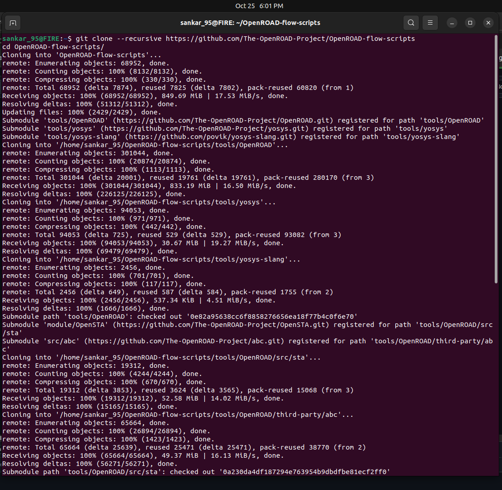
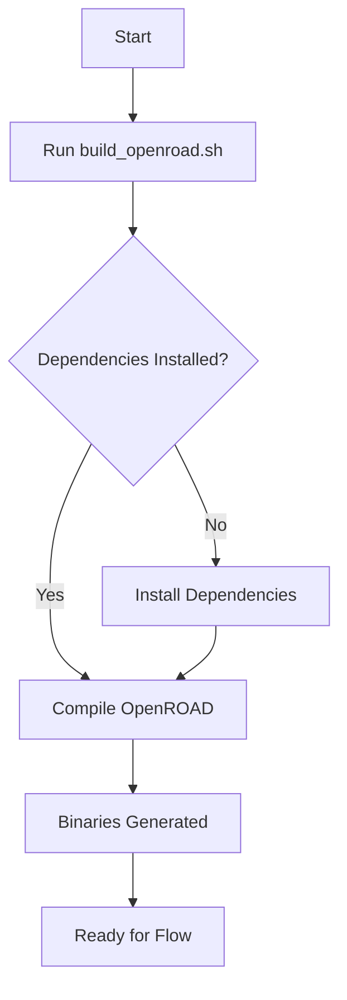
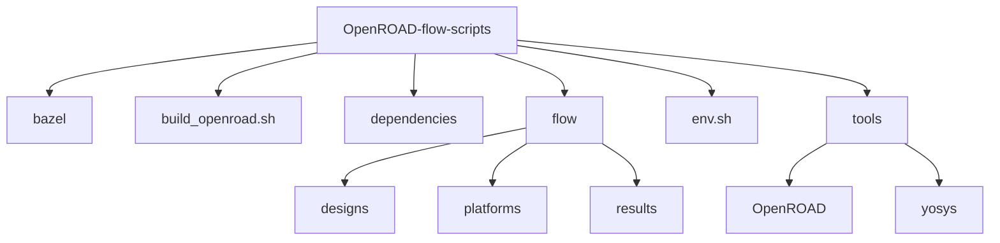
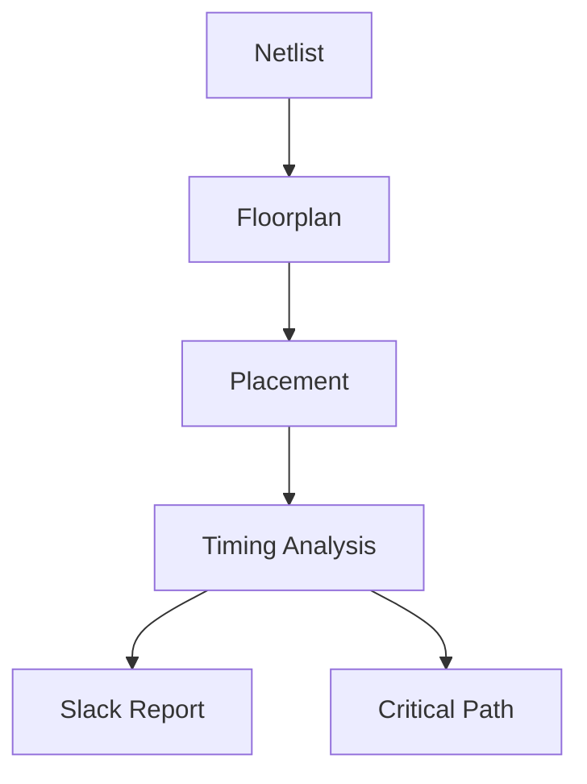

# 🚀 Week 5 — Mastering OpenROAD Flow: Installation, Floorplan, and Placement

## 🌟 RISC-V SoC Tapeout Adventure

Welcome to the electrifying **Week 5** of the **RISC-V SoC Tapeout Program**! This week, you're diving into the exhilarating world of **backend physical design** using the cutting-edge **OpenROAD Flow Scripts (ORFS)** — an open-source, fully automated RTL-to-GDSII system that transforms your digital dreams into silicon reality. 🛠️✨

Here, you'll conquer the **installation of OpenROAD**, execute the **Floorplan** and **Placement** stages, and witness your design take physical form. Buckle up for a thrilling ride from abstract netlists to geometric layouts! 🎢

---

## 🎯 Mission Objective

Your goal is to establish the **OpenROAD Flow Scripts** environment, validate it, and run the **Floorplan** and **Placement** phases on a sample design (like the trusty `gcd` using the Nangate45 PDK). This is your leap from transistor-level circuits (Week 4) to **physical chip realization**, where logic gates morph into tangible silicon layouts.

---

## 🧠 Why This Matters

After mastering CMOS behavior with SPICE, you're now stepping into the arena of **physical design automation**. This week equips you with the skills to:

- Define **die and core dimensions** during floorplanning.
- Optimize **standard cell placement** for area and timing.
- Harness **OpenROAD’s automation** to streamline backend design.

By the end, you'll see how your circuits evolve into a structured, silicon-ready layout! 🌍

---

## 🛠️ Step-by-Step OpenROAD Flow Setup

Let’s embark on this setup journey with clear, actionable steps, sprinkled with visual aids and tables for clarity.

### 1️⃣ Clone the OpenROAD Repository

Kick things off by grabbing the OpenROAD Flow Scripts:

```bash
git clone --recursive https://github.com/The-OpenROAD-Project/OpenROAD-flow-scripts
cd OpenROAD-flow-scripts/
```

| **Step**            | **Command**                              | **Purpose**                              |
|---------------------|------------------------------------------|------------------------------------------|
| Clone Repository    | `git clone --recursive ...`              | Downloads ORFS with all submodules       |
| Navigate to Folder  | `cd OpenROAD-flow-scripts/`              | Sets working directory for setup          |

📸 **Visual Checkpoint**  

  <p align="center">
   
</p>


---

### 2️⃣ Execute the Setup Script

Prepare your environment by installing dependencies:

```bash
sudo ./setup.sh
```

This script sets up all required libraries and tools for compilation.

| **Dependency**       | **Role**                                  |
|----------------------|-------------------------------------------|
| Yosys                | Logic synthesis tool                     |
| OpenROAD             | Physical design automation               |
| Nangate45 PDK        | Process design kit for sample designs     |

📸 **Visual Checkpoint**  

 <p align="center">
   
</p>

---

### 3️⃣ Build OpenROAD

Compile OpenROAD from source to create the flow binaries:

```bash
./build_openroad.sh --local
```

| **Parameter**        | **Description**                           |
|----------------------|-------------------------------------------|
| `--local`            | Builds binaries locally without Docker    |

📊 **Build Process Graph**  


---

### 4️⃣ Source Environment and Verify

Activate the environment and confirm the tools are ready:

```bash
source ./env.sh
yosys -help
openroad -help
```

| **Tool**             | **Command**           | **Expected Output**                     |
|----------------------|-----------------------|-----------------------------------------|
| Yosys                | `yosys -help`         | Displays synthesis tool help             |
| OpenROAD             | `openroad -help`      | Displays physical design tool help      |

---

### 5️⃣ Run the OpenROAD Flow

Execute the flow on a sample design:

```bash
cd flow/
make
```

This processes the `gcd` design using the Nangate45 PDK, generating floorplan and placement outputs.

| **Stage**            | **Output**                                |
|----------------------|-------------------------------------------|
| Synthesis            | Netlist (Verilog to gate-level)           |
| Floorplan            | Core and die boundaries                   |
| Placement            | Standard cell positions                   |


---

### 6️⃣ Launch the OpenROAD GUI

Visualize your masterpiece:

```bash
make gui_final
```

This opens the **OpenROAD GUI**, showcasing the **floorplan**, **placement**, and **timing analysis**.

| **GUI Feature**      | **Description**                           |
|----------------------|-------------------------------------------|
| Core Area            | Visualizes die and core boundaries        |
| Cell Placement       | Shows standard cell locations             |
| Timing Charts        | Displays slack and timing metrics         |

📸 **GUI Snapshot**  

  <p align="center">
   
</p>


---

## 📂 OpenROAD Flow Directory Breakdown

Explore the ORFS structure with this detailed table:

| **Directory/File**            | **Purpose**                                      |
|-------------------------------|--------------------------------------------------|
| `bazel/`                      | Bazel build configurations                       |
| `build_openroad.sh`           | Script to compile OpenROAD locally               |
| `dependencies/`               | Libraries and tools (bin, include, lib, share)   |
| `flow/`                       | Core RTL-to-GDSII flow environment               |
| `flow/designs/`               | Example designs (e.g., `gcd`)                    |
| `flow/platforms/`             | PDK files (e.g., Nangate45)                      |
| `flow/results/`               | Output files (DEF, GDS, ODB, logs)               |
| `env.sh`                      | Environment setup script                         |
| `tools/OpenROAD/`             | Compiled OpenROAD binaries                       |
| `tools/yosys/`                | Yosys synthesis tool                             |

📊 **Directory Structure Diagram**  


---


📊 **Timing Analysis Graph**  


---

## 🏆 Week 5 Achievements

Here’s what you’ve accomplished:

- **Installed** and validated the OpenROAD Flow Scripts environment.
- Executed **Floorplan** and **Placement** stages on a sample design.
- Visualized the layout in the **OpenROAD GUI**, complete with timing insights.

| **Milestone**                | **Outcome**                              |
|------------------------------|------------------------------------------|
| Installation                 | OpenROAD and Yosys ready                 |
| Floorplan                    | Core and die boundaries defined          |
| Placement                    | Optimized cell layout                    |
| GUI Visualization            | Layout and timing analysis viewed        |

---

## 🛠️ Troubleshooting Build Errors

If `./build_openroad.sh --local` fails, tweak the `CMakeLists.txt` in `tools/OpenROAD/`:

1. **Open the File**:
   ```bash
   nano tools/OpenROAD/CMakeLists.txt
   ```

2. **Key Modifications**:
   - Ensure `target_compile_definitions` includes `GPU` and `BUILD_PYTHON=0` (if not using Python).
   - Comment out `add_subdirectory(test)` to skip tests.
   - For GCC ≥ 9.1, remove `stdc++fs` linking to avoid errors.

3. **Re-run Build**:
   ```bash
   ./build_openroad.sh --local
   ```

| **Error**                    | **Fix**                                  |
|------------------------------|------------------------------------------|
| Missing `stdc++fs`           | Remove `link_libraries(stdc++fs)`        |
| Test Build Failure           | Disable `add_subdirectory(test)`         |
| Compiler Version Mismatch    | Adjust version checks in CMakeLists.txt  |

---

## 📚 Key Takeaways

- Transitioned from **transistor-level design** to **physical design automation**.
- Learned how **netlists** become **physical layouts** via floorplan and placement.
- Mastered OpenROAD’s **automation** for backend design efficiency.

📊 **Learning Progression Graph**  


---

## 🔗 References

- [spatha0011 / VSD Hardware Design Program (Day 14)](https://github.com/spatha0011/spatha_vsd-hdp/blob/main/Day14/README.md)
- [OpenROAD Flow Scripts GitHub](https://github.com/The-OpenROAD-Project/OpenROAD-flow-scripts)

---

## 🚀 What’s Next?

In **Week 6 – Clock Tree Synthesis and Routing**, you’ll build on this week’s floorplanned design to implement **clock distribution** and **interconnect routing**. Get ready to tackle **clock skew**, **routing congestion**, and performance optimization as you march toward a sign-off-ready chip! 🕒🔌

🏁 **Week 5 Complete!** You’re now a step closer to mastering the art of silicon design. Keep shining! ✨
