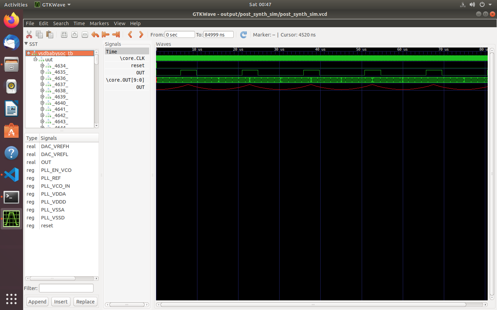

<!--
  ██████╗  █████╗ ██████╗ ██╗   ██╗███████╗ ██████╗ ██████╗  ██████╗
  ██╔══██╗██╔══██╗██╔══██╗██║   ██║██╔════╝██╔═══██╗██╔══██╗██╔═══██╗
  ██████╔╝███████║██████╔╝██║   ██║█████╗  ██║   ██║██║  ██║██║   ██║
  ██╔═══╝ ██╔══██║██╔══██╗██║   ██║██╔══╝  ██║   ██║██║  ██║██║   ██║
  ██║     ██║  ██║██║  ██║╚██████╔╝███████╗╚██████╔╝██████╔╝╚██████╔╝
  ╚═╝     ╚═╝  ╚═╝╚═╝  ╚═╝ ╚═════╝ ╚══════╝ ╚═════╝ ╚═════╝  ╚═════╝
-->

<p align="center">
  
  <br/>
  
</p>

# 🚀 Week 2: Embarking on the **BabySoC Adventure**  
### _Fundamentals and Functional Modeling_

> <kbd><i>“Imagine building a miniature universe on a single chip – that’s the magic of SoC design!”</i></kbd>

---

## 🗺️ **Your Treasure Map: Week 2 Overview**

Welcome, SoC Explorer! 🧭  
This week, we’ll journey from **theory** to **hands-on simulation**, blending stories, analogies, and creative labs.  
By the end, you’ll not only grasp SoC fundamentals but also **simulate a tiny SoC** called BabySoC and watch its “heartbeat” come alive in waveforms.

---

## 🌟 **What is a System-on-Chip (SoC)?**  
### The Tiny Powerhouse Explained

<details>
  <summary><strong>Imagine a <i>bustling city on a postage stamp</i> – that’s an SoC!</strong></summary>

A System-on-Chip crams:
- 🧠 <b>Processor (CPU/GPU):</b> The decision-maker (like a mayor).
- 🗄️ <b>Memory:</b> Quick-access storage.
- 🛣️ <b>Interconnects:</b> Highways connecting city blocks.
- 🔌 <b>Peripherals:</b> Timers, ports, converters (the city’s utilities).
- ⏰ <b>Clock & Power Management:</b> The city’s metronome.

</details>

**Why SoCs Rock:**  
> 📦 <b>Compact & Efficient:</b> Like a smartphone in your pocket.  
> ⚡ <b>High Performance:</b> Neighbors talk at lightning speed.  
> 🎨 <b>Customizable:</b> Mix-and-match digital and analog magic.  

> _Fun fact: Modern SoCs juggle everything from AI to wireless signals!_

---

## 🏗️ **The Theory Behind SoC Design**

> Designing an SoC is like architecting a city! 🏙️

<details>
  <summary><b>Four Steps to City Planning:</b></summary>

1. 📝 <b>Start with requirements</b> (“What will our city do?”)
2. 🖊️ <b>Model functionally</b> (draw blueprints)
3. 🧪 <b>Simulate</b> (test it virtually)
4. 🕵️ <b>Verify</b> (“Are there traffic jams?”)
</details>

You’ll use **Verilog** to describe your city in code, then **simulate** to see if it “lives” as expected.

🧯 **Common challenges:**  
💧 Power leaks (wasteful buildings)  
⏱️ Timing issues (late buses!)

---

## 🤖 **Meet BabySoC: Your Mini SoC Playground**

> <kbd>BabySoC = <b>A tiny orchestra</b>:</kbd>

🎼 **RVMyth Core:** The conductor (RISC-V brain)  
🥁 **PLL:** Keeps the beat (clock generator)  
🎺 **DAC:** Plays the tune (digital → analog)  

**Goal:** Simulate BabySoC and watch the signals flow!  
<blockquote>
  “Think of BabySoC as a baby robot learning to walk – simple, powerful, and fun!”
</blockquote>

---

## 🎯 **Objective of Week 2**

- 🧠 Master SoC basics  
- 🎨 Model BabySoC using Verilog  
- 🔬 Simulate and <b>visualize waveforms</b> (reset, clocking, dataflow)

---

# 🛠️ Part 2: **Hands-On Labs – Functional Modeling Magic**

Let’s get your hands dirty! 🧤  
You’ll use:

-  **Icarus Verilog** (`iverilog`): Verilog compiler/simulator  
-  **GTKWave**: Waveform viewer  

---

## ⚙️ **Installation Guide (Ubuntu/Linux)**

```bash
sudo apt update
sudo apt install make python3 python3-pip git iverilog gtkwave
pip3 install pyyaml click sandpiper-saas   # (for Python extras)
```

### 🔍 *Test Your Tools*

```bash
iverilog -v      # Should print version info
gtkwave          # Should open the viewer
```
> _Windows? Use [WSL](https://learn.microsoft.com/en-us/windows/wsl/) or a VM!_

---

## 🧑‍💻 **Step-by-Step Lab Guide**

### 1. 🚚 **Clone the BabySoC Project**  
```bash
git clone https://github.com/manili/VSDBabySoC.git
cd VSDBabySoC
```
_Or use:_  
`git clone https://github.com/hemanthkumardm/SFAL-VSD-SoC-Journey.git`  
_Navigate to `/12. VSDBabySoC Project`._

---

### 2. 🏗️ **Compile the Verilog Modules**  
```bash
make pre_synth_sim
```
- Icarus Verilog processes modules: `vsdbabysoc.v`, `rvmyth.v` (core), `avsddac.v` (DAC), `avsddll.v` (PLL).
- Generates `.vcd` file in `output/pre_synth_sim/`.

---

### 3. ▶️ **Run the Simulation**  
```bash
vvp output/pre_synth_sim.out  # If not using Makefile
```
- Creates `pre_synth_sim.vcd` – a “video recording” of your SoC’s heartbeat.

---

### 4. 👀 **Open & Analyze Waveforms with GTKWave**  
```bash
gtkwave output/pre_synth_sim/pre_synth_sim.vcd
```
- **Reset:** Watch reset signal go low (waking up from sleep).
- **Clock:** See steady pulses (like a ticking clock).
- **Dataflow:** Trace info from RVMyth to DAC (the relay race!).

> <kbd>**Waveforms = EKG readings for your chip!**</kbd>  
> Spikes = activity, flat = idle. Group signals for clarity.

---

## 📝 **Document Your Adventure**

1. **Simulation Logs:**  
   _Copy terminal outputs, e.g._  
   ```
   VCD info: dumpfile pre_synth_sim.vcd opened for output.
   ```

2. **GTKWave Screenshots:**  
   - 📷 Take 3–5 key shots (File > Write Save File for configs)
   - Annotate with markers!

---

### 📸 **Example Screenshot Gallery**

<table>
  <tr>
    <td align="center"><br/>
      <b>Reset:</b> All signals initialize as reset goes low.</td>
    <td align="center"><br/>
      <b>Clocking:</b> PLL generates a steady ~90 MHz clock.</td>
    <td align="center"><br/>
      <b>Dataflow:</b> Core output feeds DAC, simulating analog output.</td>
  </tr>
</table>

### **PRE SIMULATION**

<p align="center">
   
</p>

---

### **POST SIMULATION**
<p align="center">
   
</p>


---

### ✍️ **Explanations**

- **Reset:**  
  > _“At t=0, `reset=1` (high), all registers clear to 0. After `reset=0`, the clock starts oscillating and modules spring to life.”_

- **Clocking:**  
  > _“Here, the PLL-generated clock has an 11ns period, matching design specs. All modules synchronize to this pulse.”_

- **Dataflow:**  
  > _“This shows digital instructions flowing from the RVMyth core to the DAC, illustrating the core’s output transforming into an analog-like waveform.”_

---

## 🌈 **Advanced Twists (Optional Fun!)**

- **Post-Synthesis Simulation:**  
  ```bash
  make synth
  make post_synth_sim
  ```
  _Compare pre/post-synthesis waveforms (extra delays may appear!)._

- **Timing Analysis:**  
  ```bash
  make sta
  ```
  _Ensure your city runs on schedule (no “slack” issues!)._

---

# 🏅 **Deliverables Checklist**

- 📄 **Simulation Logs** (copy-paste terminal output)
- 🖼️ **GTKWave Screenshots** (with annotations)
- ✏️ **Short Explanations** (one paragraph per screenshot)

---

<div align="center">

## 🎉 Congratulations!

You’ve built and simulated a tiny universe on a chip.  
Share your logs, screenshots, and insights – and get ready to build even more complex cities in the coming weeks!

<blockquote>
  “SoC design is like composing a symphony – every signal, every module, in perfect harmony. Bravo!”
</blockquote>

**Happy Simulating!**  
_Use this markdown as your digital lab notebook and show off your adventure!_

</div>
