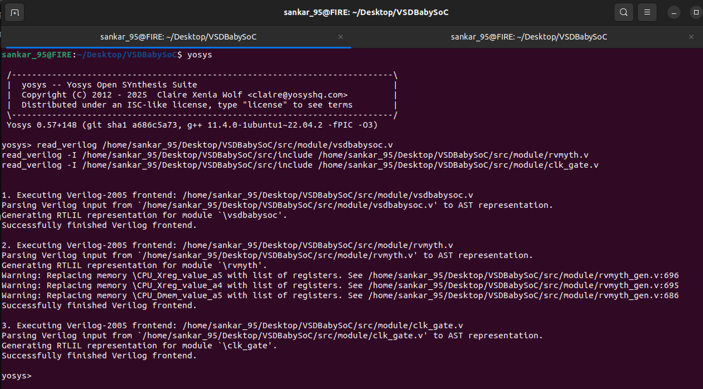
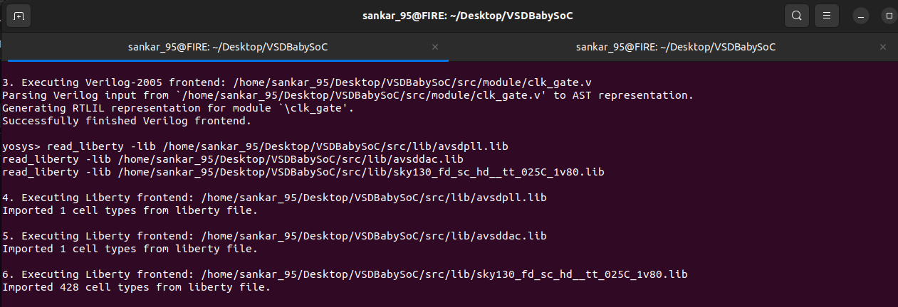
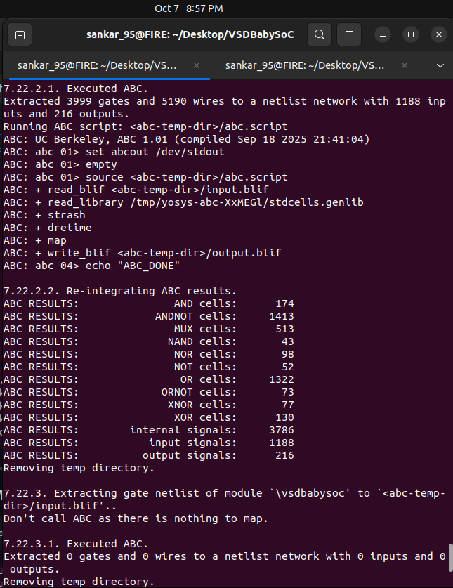
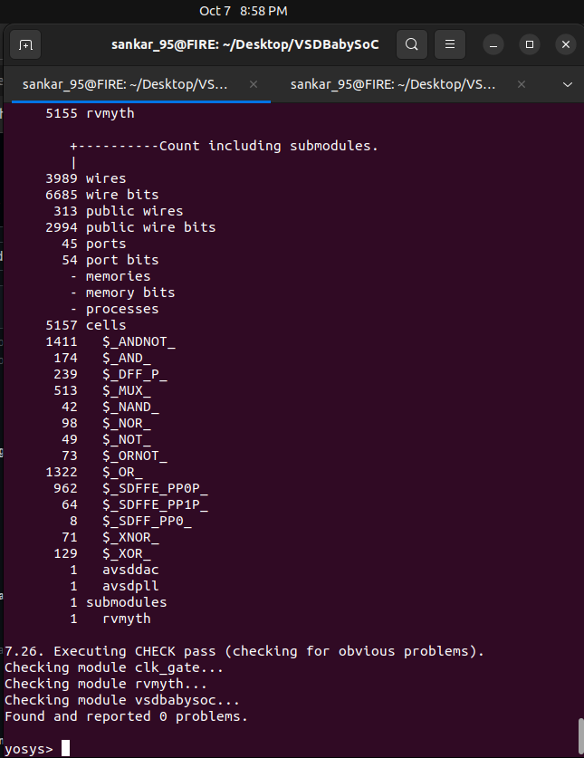
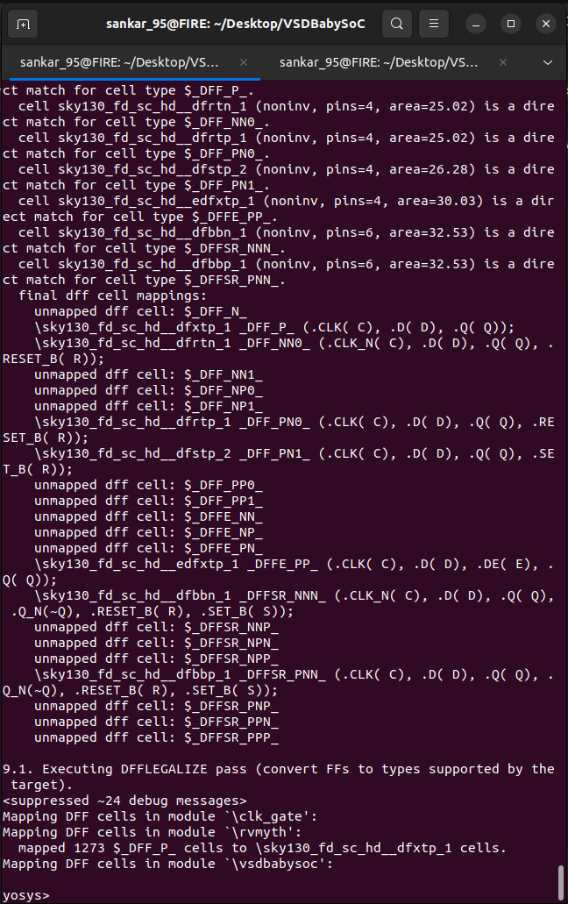
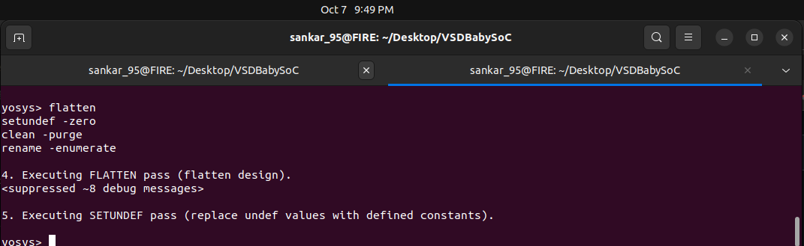
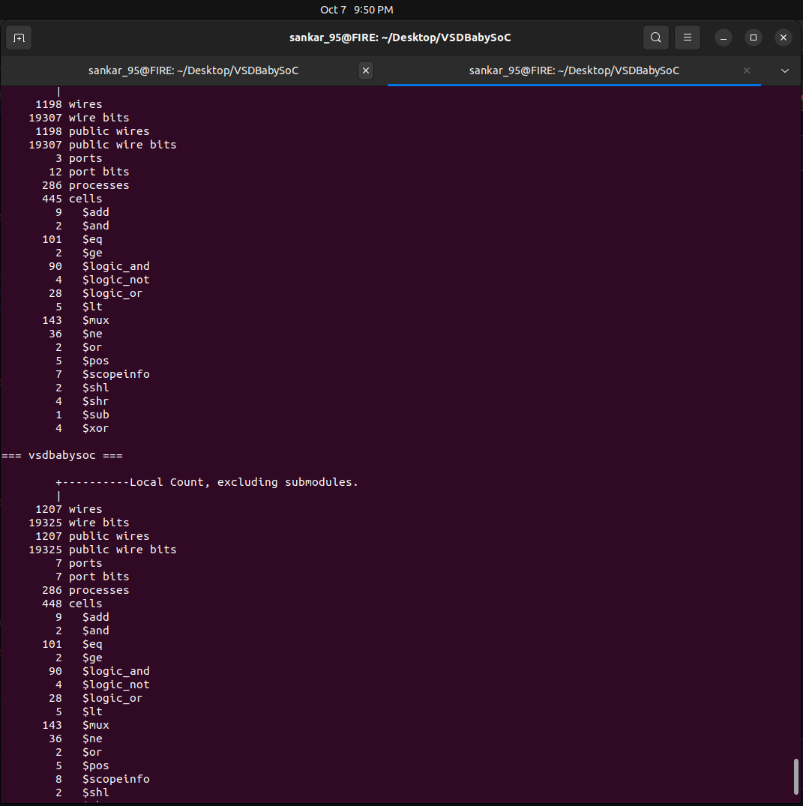
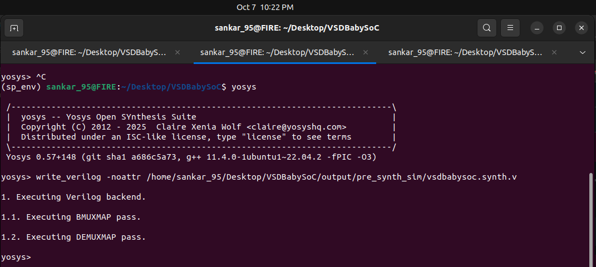
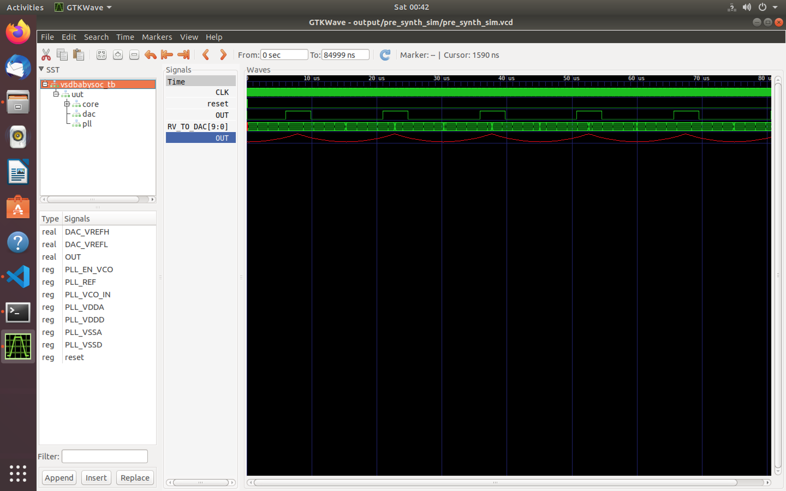

# 🚀 GLS of BabySoC: Post-Synthesis Simulation 🧩

---

## 🎯 **Purpose of Gate-Level Simulation (GLS)**

Gate-Level Simulation (GLS) is a critical step to verify the functionality of the **BabySoC** design after synthesis. Unlike RTL simulations, which operate at a higher abstraction level, GLS uses the **synthesized netlist**, ensuring the design's logical behavior and timing are preserved when mapped to actual gates.

---

## 🔑 **Key Aspects of GLS for BabySoC**

| **Aspect**                     | **Description**                                                                 |
|-------------------------------|--------------------------------------------------------------------------------|
| **Timing Verification**        | Uses Standard Delay Format (SDF) files to validate timing under real-world constraints. |
| **Design Validation**          | Ensures logical behavior remains intact post-synthesis, free from issues like metastability or glitches. |
| **Simulation Tools**           | Employs tools like **Icarus Verilog** for simulation and **GTKWave** for waveform analysis. |
| **BabySoC Relevance**          | Validates interactions between modules (e.g., RISC-V processor, PLL, DAC) and ensures timing compliance. |

---

## 🛠 **Environment Setup**

### 🗂 **Directory Structure**

```
VSDBabySoC/
├── src/
│   ├── include/
│   └── module/
│       ├── vsdbabysoc.v
│       ├── rvmyth.v
│       ├── clk_gate.v
│       ├── testbench.v
│       └── <other RTL modules>
└── output/
    ├── post_synth_sim/
    └── <other directories>
```

### 🧰 **Tools Used**

| **Tool**              | **Purpose**                          |
|-----------------------|--------------------------------------|
| **Yosys**             | Logic synthesis                     |
| **Icarus Verilog**    | GLS simulation                      |
| **GTKWave**           | Waveform visualization              |

---

## ⚙️ **Step-by-Step Execution Plan**

### 🧭 **Step 1: Load the Top-Level Design and Supporting Modules**

Launch Yosys in the required directory:

```bash
yosys
```

Execute in the Yosys shell:

```yosys
read_verilog /home/sankar_95/Desktop/VSDBabySoC/src/module/vsdbabysoc.v
read_verilog -I /home/sankar_95/Desktop/VSDBabySoC/src/include /home/sankar_95/Desktop/VSDBabySoC/src/module/rvmyth.v
read_verilog -I /home/sankar_95/Desktop/VSDBabySoC/src/include /home/sankar_95/Desktop/VSDBabySoC/src/module/clk_gate.v
```
  <p align="center">
   
</p>

---

### 🔧 **Step 2: Load Liberty Files for Synthesis**

```yosys
read_liberty -lib /home/sankar_95/Desktop/VSDBabySoC/src/lib/avsdpll.lib
read_liberty -lib /home/sankar_95/Desktop/VSDBabySoC/src/lib/avsddac.lib
read_liberty -lib /home/sankar_95/Desktop/VSDBabySoC/src/lib/sky130_fd_sc_hd__tt_025C_1v80.lib
```
  <p align="center">
   
</p>

---

### 🧮 **Step 3: Run Synthesis Targeting `vsdbabysoc`**

-It replaces generic DFFs with technology-specific ones (from sky130_fd_sc_hd__tt_025C_1v80.lib) so timing, area, and power match the real silicon cells.

```yosys
synth -top vsdbabysoc
```
  <p align="center">
   
</p>

  <p align="center">
   
</p>

---

### 🔄 **Step 4: Map D Flip-Flops to Standard Cells**

```yosys
dfflibmap -liberty /home/sankar_95/Desktop/VSDBabySoC/src/lib/sky130_fd_sc_hd__tt_025C_1v80.lib
```
  <p align="center">
   
</p>

---

### ⚙️ **Step 5: Perform Optimization and Technology Mapping**

```yosys
opt
abc -liberty /home/sankar_95/Desktop/VSDBabySoC/src/lib/sky130_fd_sc_hd__tt_025C_1v80.lib -script +strash;scorr;ifraig;retime;{D};strash;dch,-f;map,-M,1,{D}
```

---

### 🧹 **Step 6: Perform Final Clean-Up and Renaming**

```yosys
flatten
setundef -zero
clean -purge
rename -enumerate
```
  <p align="center">
   
</p>

---

### 📊 **Step 7: Check Statistics**

```yosys
stat
```
  <p align="center">
   
</p>

---

### 💾 **Step 8: Write the Synthesized Netlist**

```yosys
write_verilog -noattr /home/sankar_95/Desktop/VSDBabySoC/output/post_synth_sim/vsdbabysoc.synth.v
```
  <p align="center">
   
</p>

---

## 📈 **Post-Synthesis Simulation and Waveforms**

### 🧪 **Step 1: Compile the Testbench**

```bash
iverilog -o /home/ananya123/VSDBabySoCC/VSDBabySoC/output/post_synth_sim/post_synth_sim.out \
    -DPOST_SYNTH_SIM -DFUNCTIONAL -DUNIT_DELAY=#1 \
    -I /home/ananya123/VSDBabySoCC/VSDBabySoC/src/include \
    -I /home/ananya123/VSDBabySoCC/VSDBabySoC/src/module \
    /home/ananya123/VSDBabySoCC/VSDBabySoC/src/module/testbench.v
```

---

### 📂 **Step 2: Navigate to the Output Directory**

```bash
cd output/post_synth_sim/
```

---

### ▶️ **Step 3: Run the Simulation**

```bash
./post_synth_sim.out
```

---

### 📉 **Step 4: View Waveforms in GTKWave**

```bash
gtkwave post_synth_sim.vcd
```

 <p align="center">
   
</p>
 <p align="center">
   
</p>


# 📊 Pre vs Post Synthesis Comparison

| 🧠 Simulation Type         | 🔍 Level   | 🎯 Purpose                              | 📁 Output            |
| :------------------------- | :--------- | :-------------------------------------- | :------------------- |
| 🌿 **Pre-Synthesis (RTL)** | Behavioral | Functional check before synthesis       | `pre_synth_sim.vcd`  |
| ⚡ **Post-Synthesis (GLS)** | Structural | Checks real gate-level timing and logic | `post_synth_sim.vcd` |

📈 **Waveform Comparison:**


---

---

## 📊 **Results & Observations**

| **Parameter**            | **Pre-Synthesis (RTL)** | **Post-Synthesis (GLS)** | **Remarks**                          |
|--------------------------|-------------------------|--------------------------|--------------------------------------|
| **Simulation Model**     | Behavioral (RTL)        | Structural (Gate-Level) |                                      |
| **Waveform Transition**  | ✓ Valid                | ✓ Matches RTL           | Functionally equivalent             |
| **Functionality**        | Correct                 | Preserved               | No synthesis-induced discrepancies  |
| **Timing (Delays)**      | Ideal                   | Gate-based              | Reflects synthesis delays           |
| **Clock/Reset Behavior** | Stable                  | Stable                  | Consistent behavior                 |

**Observation**:  
The GLS waveform aligns perfectly with the RTL waveform, validating the synthesis process and ensuring functional equivalence

---

## 🧾 **Deliverables**

1. **Synthesized Netlist**  
   - File: `/home/ananya123/VSDBabySoCC/VSDBabySoC/output/post_synth_sim/vsdbabysoc.synth.v`

2. **GLS Waveform**  
   - File: `/home/ananya123/VSDBabySoCC/VSDBabySoC/output/post_synth_sim/post_synth_sim.vcd`

3. **Waveform Screenshots**  
   - Available via provided GitHub links.

4. **Short Note**  
   > The Gate-Level Simulation of BabySoC validates the post-synthesis netlist, ensuring functional equivalence with the RTL design and correct timing behavior under synthesized conditions.

---

## 📚 **References**

- [Yosys Open Synthesis Suite](https://yosyshq.net/yosys/)
- [Icarus Verilog](http://iverilog.icarus.com/)
- [GTKWave Viewer](https://gtkwave.sourceforge.net/)

---

## 🧑‍💻 **Author**

**Ananya**

---

> **Note**: This enhanced markdown provides a clear, structured, and visually appealing guide to performing GLS for BabySoC, complete with tables, emojis, and organized sections for better readability. 🚀
