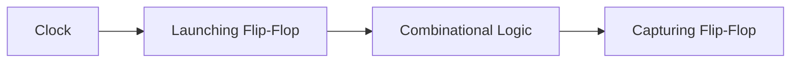
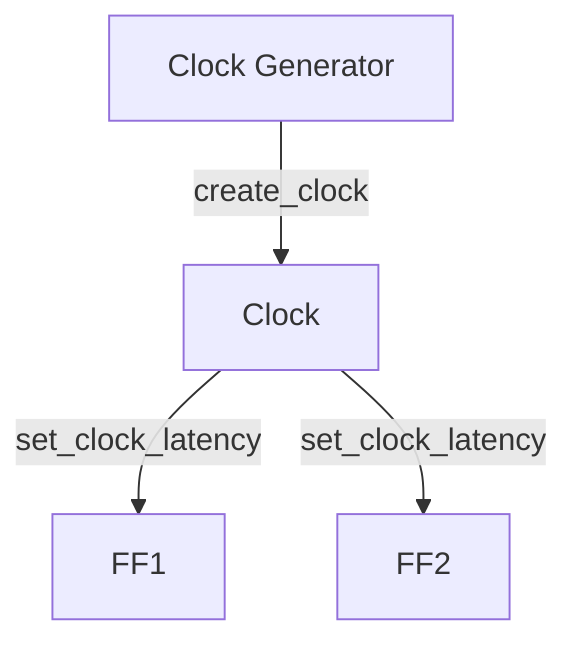

# 🕒 Static Timing Analysis (STA) — Key Notes

---

## ⚙️ Core Concepts

Static Timing Analysis (STA) ensures digital circuits meet timing requirements **without** running dynamic simulations.

- **Checks:** Path delays, setup/hold, slack between launch/capture flip-flops.
- **Goal:** All paths meet timing for chip sign-off.

---

## 🧩 Timing Path Basics

*Timing Path: Clock → Launching FF → Logic → Capturing FF*

**Key Metrics:**
- **Arrival Time (AAT):** Actual time signal reaches capturing FF.
- **Required Arrival Time (RAT):** Latest/earliest time signal *should* arrive.
- **Slack:** `Slack = RAT – AAT`
  - 🟢 **Positive Slack:** Path meets timing
  - 🔴 **Negative Slack:** Timing violation!

---

## ⏱ Setup & Hold Checks

| Check      | Condition                                       | Violation Effect            |
|------------|-------------------------------------------------|-----------------------------|
| **Setup**  | Data must arrive *before* clock edge (max delay)| Metastability, data error   |
| **Hold**   | Data must remain stable *after* clock edge (min)| Incorrect data capture      |

- **Violations** lead to design failure or unpredictable behavior!

---

## 🔔 Clock Concepts

*Clock defined via `create_clock`, `create_generated_clock`, `set_clock_latency`*

**Important Parameters:**
- **Jitter:** Random clock edge variation
- **Skew:** Difference in clock arrival at different FFs
- **Clock Path Delay:** Affects setup and hold timing

---

## 🧮 Timing Computation

- **Gate Pin → Node Mapping**
- **Core Computations:**
  - **Actual Arrival Time (AAT):** Sum of gate & net delays
  - **Required Arrival Time (RAT):** `Clock period – setup/hold margins`
  - **Slack:** Calculated from AAT & RAT

**Analysis Types:**
- **GBA (Graph-Based Analysis):** Fast, conservative
- **PBA (Path-Based Analysis):** Accurate, per-path optimization

---

## 📈 Library & Device Parameters

| Parameter     | Description                                             | Impact        |
|---------------|--------------------------------------------------------|---------------|
| **Slew**      | Transition rate of a signal                            | Cell delay    |
| **Load**      | Output capacitance                                     | More delay    |
| **Clk-Q Delay**| FF propagation time                                   | Timing margin |
| **Setup/Hold**| Times from transistor-level simulation of FFs          | Reliability   |

---

## ⚡ Variations & OCV

- **OCV (On-Chip Variation):**  
  - Accounts for changes in process, voltage, temperature
  - Separate analyses for setup (max delay) and hold (min delay)
- **Pessimism Removal:**  
  - Prevents double-counting of skew/variation

---

## 📊 Jitter & Eye Diagram

**Eye Diagram Example:**

*(Shows overlap of clock/data, used for jitter margin)*

- **Jitter Analysis:** Ensures reliable setup timing even under clock variations

---

## 📋 Slack Distribution Graph

*(Example: Insert a histogram using matplotlib/seaborn, or link to a PNG in your repo)*

> *Slack distribution across all timing paths. Negative slack (red) indicates violations.*

---

## ✅ Key Takeaways

- **STA = Deterministic, vectorless timing verification**
- Ensure:
  - **Setup Slack ≥ 0**
  - **Hold Slack ≥ 0**
  - All paths analyzed for timing
- **Focus on:** Clock, data path delay, skew, uncertainty, OCV
- **Foundation for:** Timing closure & sign-off in chip design

---

> **STA is the backbone of robust chip design. Visualize paths, analyze slack, and sign-off with confidence! 🌟**

---

### 📚 References

- [OpenSTA GitHub](https://github.com/The-OpenROAD-Project/OpenSTA)
- [Eye Diagram - Wikipedia](https://en.wikipedia.org/wiki/Eye_pattern)
- [STA Concepts - Synopsys](https://www.synopsys.com/glossary/what-is-static-timing-analysis.html)
