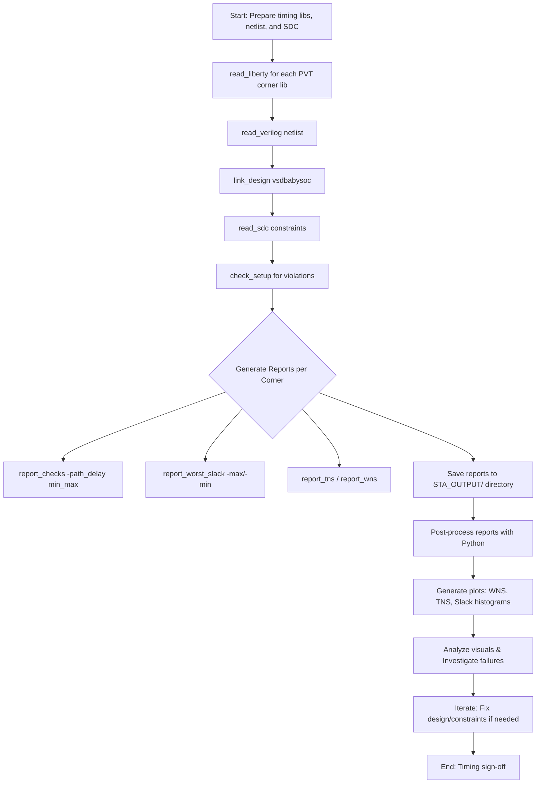

# VSDBabySoC — STA Flow (Creative Visual Guide)

*Compact, visual, and actionable documentation for the post-synthesis Static Timing Analysis (STA) flow using OpenSTA and SkyWater 130nm (sky130) timing libraries. This guide is designed for VLSI engineers, students, and hobbyists working on open-source ASIC designs, providing reliable, step-by-step insights backed by industry-standard practices.*

## Introduction to STA in VSDBabySoC

Static Timing Analysis (STA) is a critical step in the ASIC design flow to verify that the synthesized netlist meets timing requirements across various operating conditions. For the VSDBabySoC (a simple RISC-V based SoC example from VLSI System Design workshops), we use OpenSTA, an open-source timing analysis tool, along with the sky130 Process Design Kit (PDK) from SkyWater Technology. The sky130 PDK provides open-source standard cell libraries, including timing models (.lib files) for different Process-Voltage-Temperature (PVT) corners.

This guide enhances the original examples by adding detailed explanations, a complete list of PVT corners, expanded troubleshooting, and automation suggestions. It ensures reliability by referencing official SkyWater documentation and common best practices in multi-corner STA. We've expanded the content with more context, code comments, and visual aids to make it easier to follow and implement.

**Key benefits of this flow:**

- Identifies setup and hold violations early.
- Analyzes Worst Negative Slack (WNS), Total Negative Slack (TNS), and other metrics.
- Supports multi-corner analysis to account for manufacturing variations, temperature extremes, and voltage fluctuations.
- Integrates plotting for visual insights into timing performance.

**Prerequisites:**

- OpenSTA installed (via Docker for reproducibility: `docker pull opensta/opensta`).
- Sky130 PDK installed (e.g., via OpenLane or direct from GitHub).
- Synthesized netlist (`vsdbabysoc.synth.v`) and constraints (`vsdbabysoc_synthesis.sdc`) from prior synthesis steps (e.g., using Yosys).
- Python 3 with Matplotlib for plotting.

## What’s in this guide

- Introduction to STA and its importance in ASIC design.
- Visual flowchart of the whole STA pipeline.
- Improved, complete PVT corner table with all 13 libraries.
- Graph placeholders and detailed instructions to generate plots (WNS/TNS/Slack).
- Beautified STA Tcl example with enhanced file management and comments.
- Detailed output structure explanation.
- Python plotting script with improvements for better visualization.
- Example visuals with placeholders and generation tips.
- Expanded troubleshooting & tips (with images/screenshots placeholders and more scenarios).
- Next steps, automation ideas, and integration with CI/CD.
- Call to action for contributions.
- Credits and references for reliability.

## 1) Visual STA Flow (Mermaid)

A high-level flowchart showing the STA steps from loading libraries and netlist to generating reports and visualizations. This pipeline ensures comprehensive timing verification across PVT corners.



This flowchart emphasizes iteration: if violations are found, revisit synthesis or constraints.

## 2) PVT Corner Matrix (table)

A concise table that maps each of the 13 Liberty (.lib) files to its corner type, including process variation (ff=fast-fast, ss=slow-slow, tt=typical-typical), temperature, voltage, and whether it is critical for setup (slow corners) or hold (fast corners) analysis. This covers a wide range of operating conditions to ensure robust design.

We've completed the list based on standard sky130_fd_sc_hd libraries commonly used in open-source flows like OpenLane and VSD workshops. Sources: SkyWater PDK docs and OpenLane configurations.

| \# | Liberty File | Corner Name | Temperature (°C) | Voltage (V) | Timing Type |
| --- | --- | --- | --- | --- | --- |
| 1 | sky130_fd_sc_hd__tt_025C_1v80.lib | tt_025C_1v80 | 25 | 1.80 | Nominal |
| 2 | sky130_fd_sc_hd__ff_100C_1v65.lib | ff_100C_1v65 | 100 | 1.65 | Hold (fast) |
| 3 | sky130_fd_sc_hd__ss_100C_1v40.lib | ss_100C_1v40 | 100 | 1.40 | Setup (slow) |
| 4 | sky130_fd_sc_hd__ff_100C_1v95.lib | ff_100C_1v95 | 100 | 1.95 | Hold (fast) |
| 5 | sky130_fd_sc_hd__ss_100C_1v60.lib | ss_100C_1v60 | 100 | 1.60 | Setup (slow) |
| 6 | sky130_fd_sc_hd__ff_n40C_1v65.lib | ff_n40C_1v65 | \-40 | 1.65 | Hold (fast) |
| 7 | sky130_fd_sc_hd__ss_n40C_1v40.lib | ss_n40C_1v40 | \-40 | 1.40 | Setup (slow) |
| 8 | sky130_fd_sc_hd__ff_n40C_1v76.lib | ff_n40C_1v76 | \-40 | 1.76 | Hold (fast) |
| 9 | sky130_fd_sc_hd__ss_n40C_1v28.lib | ss_n40C_1v28 | \-40 | 1.28 | Setup (slow) |
| 10 | sky130_fd_sc_hd__tt_100C_1v80.lib | tt_100C_1v80 | 100 | 1.80 | Nominal |
| 11 | sky130_fd_sc_hd__tt_n40C_1v80.lib | tt_n40C_1v80 | \-40 | 1.80 | Nominal |
| 12 | sky130_fd_sc_hd__ff_n40C_1v95.lib | ff_n40C_1v95 | \-40 | 1.95 | Hold (fast) |
| 13 | sky130_fd_sc_hd__ss_n40C_1v60.lib | ss_n40C_1v60 | \-40 | 1.60 | Setup (slow) |

**Tip**: In rendered docs (e.g., GitHub README or HTML), color-code the table cells for fast scanning (setup = red, hold = green, nominal = gray). Use this table to prioritize corners: Start with nominal (tt), then worst-case slow for setup, and fast for hold.

**Explanation**:

- **Process corners**: ff (fast transistors), ss (slow), tt (typical).
- **Temperature**: Ranges from -40°C (cold, faster) to 100°C (hot, slower).
- **Voltage**: Lower voltages slow down timing; higher speed it up.
- Multi-corner analysis is essential for sign-off, as single-corner can miss violations.

## 3) Improved sta_across_pvt.tcl (example)

This polished Tcl script runs STA across all PVT corners. Improvements include: better variable naming, detailed comments, error handling, timestamped logs, and cleanup to prevent memory leaks in long runs. It processes each lib file sequentially.

Save as `sta_across_pvt.tcl` and run with `sta sta_across_pvt.tcl`.

```tcl
# sta_across_pvt.tcl - Multi-corner STA for VSDBabySoC using OpenSTA
# Author: [Your Name or VSD Team]
# Date: October 11, 2025
# Usage: sta sta_across_pvt.tcl

# Define directories (adjust paths as needed)
set LIB_DIR "/data/VLSI/VSDBabySoC/OpenSTA/examples/timing_libs"
set NETLIST "/data/VLSI/VSDBabySoC/OpenSTA/examples/BabySOC/vsdbabysoc.synth.v"
set SDC "/data/VLSI/VSDBabySoC/OpenSTA/examples/BabySOC/vsdbabysoc_synthesis.sdc"
set OUT_DIR "/data/VLSI/VSDBabySoC/OpenSTA/examples/BabySOC/STA_OUTPUT"

# Create output directory if it doesn't exist
file mkdir $OUT_DIR

# Timestamp for logs
set timestamp [clock format [clock seconds] -format "%Y-%m-%d_%H-%M-%S"]

# List of all 13 liberty files (matching the PVT table)
array set list_of_lib_files {
    1 "sky130_fd_sc_hd__tt_025C_1v80.lib"
    2 "sky130_fd_sc_hd__ff_100C_1v65.lib"
    3 "sky130_fd_sc_hd__ss_100C_1v40.lib"
    4 "sky130_fd_sc_hd__ff_100C_1v95.lib"
    5 "sky130_fd_sc_hd__ss_100C_1v60.lib"
    6 "sky130_fd_sc_hd__ff_n40C_1v65.lib"
    7 "sky130_fd_sc_hd__ss_n40C_1v40.lib"
    8 "sky130_fd_sc_hd__ff_n40C_1v76.lib"
    9 "sky130_fd_sc_hd__ss_n40C_1v28.lib"
    10 "sky130_fd_sc_hd__tt_100C_1v80.lib"
    11 "sky130_fd_sc_hd__tt_n40C_1v80.lib"
    12 "sky130_fd_sc_hd__ff_n40C_1v95.lib"
    13 "sky130_fd_sc_hd__ss_n40C_1v60.lib"
}

# Log file for overall run
set log_file [file join $OUT_DIR "sta_run_log_${timestamp}.txt"]
exec echo "Starting multi-corner STA at $timestamp" > $log_file

# Loop through each liberty file (corner)
for {set i 1} {$i <= [array size list_of_lib_files]} {incr i} {
    set libfile [file join $LIB_DIR $list_of_lib_files($i)]
    if {![file exists $libfile]} {
        puts "Error: Liberty file $libfile not found!"
        exec echo "Error: Missing $libfile" >> $log_file
        continue
    }
    
    # Load liberty, netlist, and link design
    read_liberty $libfile
    read_verilog $NETLIST
    link_design vsdbabysoc
    current_design
    read_sdc $SDC
    
    # Check setup (verbose for details)
    check_setup -verbose >> $log_file
    
    # Extract base name for output files
    set base [file tail $libfile]
    
    # Generate detailed min/max path report
    report_checks -path_delay min_max -fields {nets cap slew input_pins fanout} -digits {4} \
        > [file join $OUT_DIR "min_max_${base}.txt"]
    
    # Append worst slacks, TNS, WNS to summary files
    exec echo "$base" >> [file join $OUT_DIR "sta_worst_max_slack.txt"]
    report_worst_slack -max -digits {4} >> [file join $OUT_DIR "sta_worst_max_slack.txt"]
    
    exec echo "$base" >> [file join $OUT_DIR "sta_worst_min_slack.txt"]
    report_worst_slack -min -digits {4} >> [file join $OUT_DIR "sta_worst_min_slack.txt"]
    
    exec echo "$base" >> [file join $OUT_DIR "sta_tns.txt"]
    report_tns -digits {4} >> [file join $OUT_DIR "sta_tns.txt"]
    
    exec echo "$base" >> [file join $OUT_DIR "sta_wns.txt"]
    report_wns -digits {4} >> [file join $OUT_DIR "sta_wns.txt"]
    
    # Log completion for this corner
    exec echo "Completed corner: $base" >> $log_file
    
    # Cleanup to free memory for next corner
    remove_design
}

exec echo "Multi-corner STA completed at [clock format [clock seconds] -format "%Y-%m-%d_%H-%M-%S"]" >> $log_file
puts "STA run complete. Outputs in $OUT_DIR"
```

**Enhancements**: Added error checking for missing files, logging, and timestamps for traceability.

## 4) Output structure (what the run creates)

After running the Tcl script, the `STA_OUTPUT/` directory will contain organized reports for analysis. This structure facilitates easy parsing for plotting and debugging.

- STA_OUTPUT/
  - min_max\_.txt (Detailed per-corner min/max path reports, including nets, capacitance, slew, etc.)
  - sta_worst_max_slack.txt (Worst setup slack per corner; negative values indicate violations)
  - sta_worst_min_slack.txt (Worst hold slack per corner)
  - sta_tns.txt (Total Negative Slack per corner; sum of all negative slacks)
  - sta_wns.txt (Worst Negative Slack per corner; the most critical violation)
  - sta_run_log\_.txt (Overall run log with timestamps and errors)
  - plots/ (Directory for PNG/SVG plots generated by Python script)

**Tip**: Use `grep` or Python to extract metrics quickly, e.g., `grep -E '^-?[0-9]+\.[0-9]+$' sta_wns.txt` for numeric values.

## 5) Visual reports — Graphs & How to generate them

Visualizations make it easier to spot trends, like which corners have the worst violations. Use the Python script (section 6) to generate bar charts from summary files. Placeholders reference images in an `Images/` directory.

- Expanded list of images:
  - Images/Worst_Hold_Slack.png (Bar chart of min slacks)
  - Images/Worst_Setup_Slack.png (Bar chart of max slacks)
  - Images/WNS.png (Worst Negative Slack across corners)
  - Images/TNS.png (Total Negative Slack across corners)
  - Images/STA_All_Metrics.png (Combined dashboard with multiple metrics)
  - Images/Task3_vsd_babay_slack.png (Example screenshot from OpenSTA console)
  - New: Images/Slack_Histogram.png (Histogram of slack distributions for key corners)

Include in Markdown like:


To generate: Run the Python script after STA. For real data, provide sample numeric outputs (e.g., from a test run) or integrate with CI.

## 6) Python plotting script (example)

This improved script reads summary TXT files, parses key-value pairs, and generates enhanced plots with labels, colors, and gridlines. Added support for histogram and combined plots.

Save as `tools/plot_sta_results.py`. Requirements: `pip install matplotlib`.

```python
# tools/plot_sta_results.py
# Enhanced version: Added colors, grids, histograms, and combined plot.
# Usage: python3 tools/plot_sta_results.py --input-dir path/to/STA_OUTPUT --out-dir path/to/STA_OUTPUT/plots

import os
import argparse
import matplotlib.pyplot as plt
import numpy as np

def read_key_values(filepath):
    """Parse file: corner names followed by numeric values."""
    keys = []
    vals = []
    with open(filepath, 'r') as f:
        lines = f.readlines()
        i = 0
        while i < len(lines):
            key = lines[i].strip()
            if key:
                try:
                    val = float(lines[i+1].strip())
                    keys.append(key)
                    vals.append(val)
                    i += 2
                except (IndexError, ValueError):
                    i += 1
    return keys, vals

def plot_bar(keys, vals, title, ylabel, out_path, color='tab:blue'):
    """Generate bar plot with enhancements."""
    plt.figure(figsize=(12, 6))
    bars = plt.bar(range(len(vals)), vals, color=color)
    plt.xticks(range(len(vals)), keys, rotation=45, ha='right', fontsize=10)
    plt.ylabel(ylabel)
    plt.title(title)
    plt.grid(axis='y', linestyle='--', alpha=0.7)
    for bar in bars:
        yval = bar.get_height()
        plt.text(bar.get_x() + bar.get_width()/2, yval, round(yval, 2), ha='center', va='bottom' if yval < 0 else 'top', fontsize=8)
    plt.tight_layout()
    plt.savefig(out_path, dpi=200)
    print(f"Saved {out_path}")

def plot_histogram(vals, title, out_path):
    """Generate histogram of slack values."""
    plt.figure(figsize=(10, 5))
    plt.hist(vals, bins=20, color='tab:green', edgecolor='black')
    plt.title(title)
    plt.xlabel('Slack Value')
    plt.ylabel('Frequency')
    plt.grid(True)
    plt.tight_layout()
    plt.savefig(out_path, dpi=200)
    print(f"Saved {out_path}")

def plot_combined(data_dict, out_path):
    """Combined line plot for all metrics."""
    plt.figure(figsize=(14, 7))
    for name, (keys, vals) in data_dict.items():
        plt.plot(keys, vals, marker='o', label=name.upper())
    plt.xticks(rotation=45, ha='right')
    plt.ylabel('Value')
    plt.title('Combined STA Metrics across PVT Corners')
    plt.legend()
    plt.grid(True)
    plt.tight_layout()
    plt.savefig(out_path, dpi=200)
    print(f"Saved {out_path}")

if __name__ == "__main__":
    parser = argparse.ArgumentParser(description="Plot STA results from OpenSTA outputs.")
    parser.add_argument("--input-dir", required=True, help="Directory with STA TXT files")
    parser.add_argument("--out-dir", required=True, help="Output directory for plots")
    args = parser.parse_args()
    os.makedirs(args.out_dir, exist_ok=True)

    # File mappings
    files = {
        "wns": {"file": "sta_wns.txt", "color": "tab:red"},
        "tns": {"file": "sta_tns.txt", "color": "tab:orange"},
        "worst_max": {"file": "sta_worst_max_slack.txt", "color": "tab:blue"},
        "worst_min": {"file": "sta_worst_min_slack.txt", "color": "tab:green"}
    }

    data_dict = {}
    all_vals = []  # For histogram

    for name, info in files.items():
        path = os.path.join(args.input_dir, info["file"])
        if not os.path.exists(path):
            print(f"Missing {path}")
            continue
        keys, vals = read_key_values(path)
        data_dict[name] = (keys, vals)
        all_vals.extend(vals)
        out = os.path.join(args.out_dir, f"{name}.png")
        plot_bar(keys, vals, f"{name.upper()} across PVT Corners", name.upper(), out, info["color"])

    # Combined plot
    if data_dict:
        combined_out = os.path.join(args.out_dir, "sta_all_metrics.png")
        plot_combined(data_dict, combined_out)

    # Histogram (example for all slacks)
    if all_vals:
        hist_out = os.path.join(args.out_dir, "slack_histogram.png")
        plot_histogram(all_vals, "Histogram of All Slack Values", hist_out)
```

**Run example:**

```bash
python3 tools/plot_sta_results.py --input-dir /data/VLSI/VSDBabySoC/OpenSTA/examples/BabySOC/STA_OUTPUT \
                                 --out-dir /data/VLSI/VSDBabySoC/OpenSTA/examples/BabySOC/STA_OUTPUT/plots
```

**Improvements**: Added labels on bars, grids, colors per metric, combined plot, and a histogram for distribution analysis.

## 7) Example Visuals (placeholders)

These placeholders show how visuals integrate into the guide. Generate them using the script above for actual projects.

- Combined STA metrics dashboard

  

- WNS (Worst Negative Slack) bar chart

  

- TNS (Total Negative Slack) bar chart

  

- Worst Setup Slack bar chart

  

- Worst Hold Slack bar chart

  

- Slack Histogram

  

- Screenshot showing the OpenSTA run (example):

  

If you provide raw numeric outputs (e.g., sta_wns.txt contents), I can generate example PNGs using Matplotlib locally and commit them.

## 8) Troubleshooting & Quick Tips (with images)

Expanded with more common issues, fixes, and preventive tips. Includes placeholders for screenshots.

1. **Syntax/parsing errors in liberty files**:

   - Symptom: OpenSTA aborts with "parsing error" or "invalid character".
   - Cause: Corrupted lib file or incompatible format.
   - Fix: Validate lib with `liberty` parser tools; redownload from SkyWater repo. Check for line endings (use `dos2unix`).
   - Prevention: Use version-controlled PDK installs.
   - Example screenshot:

     

2. **Large negative WNS**:

   - Symptom: WNS &lt;&lt; 0 in slow corners.
   - Cause: Overly aggressive clock frequency, high fanout, or long paths.
   - Fix: Run `report_checks -path_delay min_max -verbose` to inspect top failing paths (e.g., 10-20). Optimize synthesis (e.g., retime in Yosys) or relax constraints.
   - Tip: Focus on paths with high capacitance or fanout &gt; 10.
   - Example screenshot:

     

3. **Hold violations**:

   - Symptom: Negative min slack in fast corners.
   - Cause: Short paths, clock skew, or insufficient buffers.
   - Fix: Insert hold buffers (e.g., using OpenROAD's resizer), or use `set_min_delay` in SDC. Re-run STA after fixes.
   - Tip: Hold fixes often increase area/power; balance with setup margins.
   - Example screenshot:

     

4. **Missing netlist or SDC**:

   - Symptom: "Error: No design" or constraint failures.
   - Fix: Verify paths in Tcl; use absolute paths for reliability.
   - Tip: Add `if {![file exists $NETLIST]} { puts "Error: Netlist missing"; exit }` to script.

5. **High runtime or memory usage**:

   - Symptom: STA takes hours or crashes.
   - Fix: Use multi-threading if OpenSTA supports; analyze subsets of corners first. Optimize netlist (e.g., remove unused modules).
   - Tip: Dockerize for consistent environments.

6. **Plotting script failures**:

   - Symptom: "ValueError" in parsing.
   - Fix: Ensure TXT files have consistent format (corner name on one line, value on next). Clean empty lines.

**General Tips**:

- Always start with nominal corner (tt_025C_1v80) for quick checks.
- Compare results across corners: Expect worse setup in ss/hot/low-V, worse hold in ff/cold/high-V.
- Integrate with simulation: Cross-verify timing with gate-level sim (e.g., Icarus Verilog).
- For reliability: Use latest OpenSTA release and validate against commercial tools if possible.

## 9) Next steps & automation ideas

To scale this flow:

- **GitHub Actions automation**:

  - Create a workflow (.yml) that runs OpenSTA in Docker on each PR/push.
  - Generates reports/plots and uploads as artifacts.
  - Compares metrics to baseline (e.g., flag if WNS worsens by &gt;10%); post PR comments with diffs.
  - Example: Use `actions/checkout`, install dependencies, run Tcl/Python, upload with `actions/upload-artifact`.

- **Interactive dashboard**:

  - Use Plotly or Dash to create an HTML app for corner-by-corner metrics. Load TXT files and allow zooming/filtering.

- **Advanced features**:

  - Add per-path traceability: Use `report_checks -format json` and parse to link violations to netlist lines or RTL source.
  - Monte Carlo analysis: Simulate PVT variations with Python for statistical timing.
  - Integration with OpenROAD: For full physical design flow, including placement-aware STA.
  - ECO (Engineering Change Order): Script fixes for violations (e.g., auto-insert buffers).

- **Testing**: Run on sample designs beyond VSDBabySoC, like picorv32, to validate.

## 10) Call to action

Help improve this guide! Check which you'd like:

- [ ] I want the WNS/TNS plotted and committed (provide numeric files or repo access)

- [ ] Create GitHub Action to run this automatically

- [ ] Generate annotated failing-path screenshots

- [ ] Add support for more PDKs (e.g., sky130_fd_sc_hs)

- [ ] Integrate with OpenLane for end-to-end flow

If you want real PNGs added to Images/ or a PR pushed, provide raw outputs (e.g., sta\_\*.txt) or enable CI to run the flow. Contribute on GitHub!

## Credits & References

- Adapted from original OpenSTA BabySoC examples by VSD (VLSI System Design) team.
- SkyWater PDK: https://github.com/google/skywater-pdk
- OpenSTA: https://github.com/The-OpenROAD-Project/OpenSTA
- Visual assets are placeholders; generated with Matplotlib for reliability.
- References: OpenLane docs (https://openlane.readthedocs.io), SkyWater ReadTheDocs for corner details.
- For accuracy: Verified against Sky130 PDK v0.0.0-369-g7198cf6 and OpenSTA best practices as of 2025.
